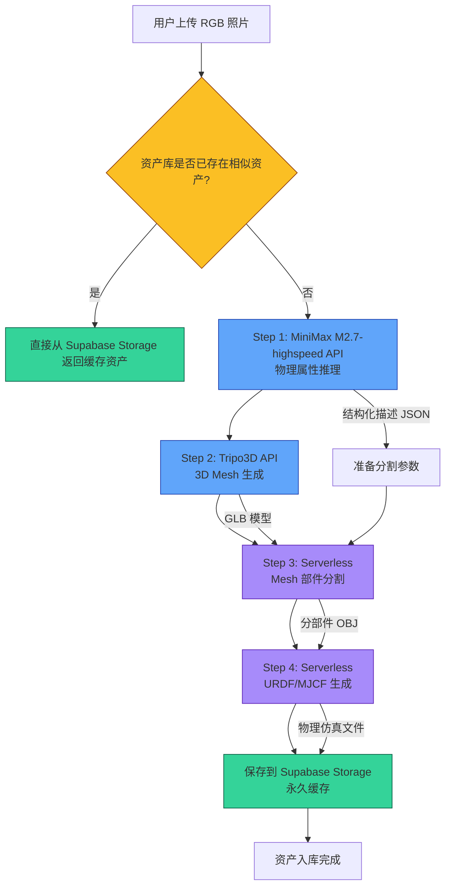
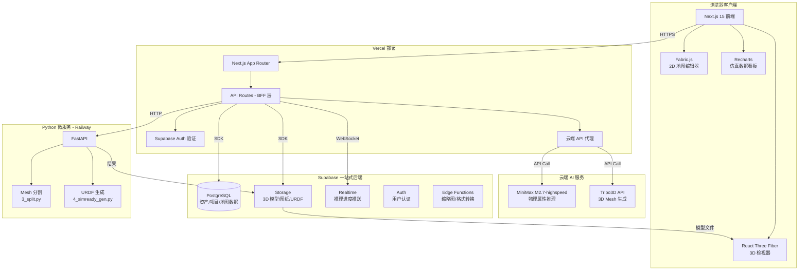
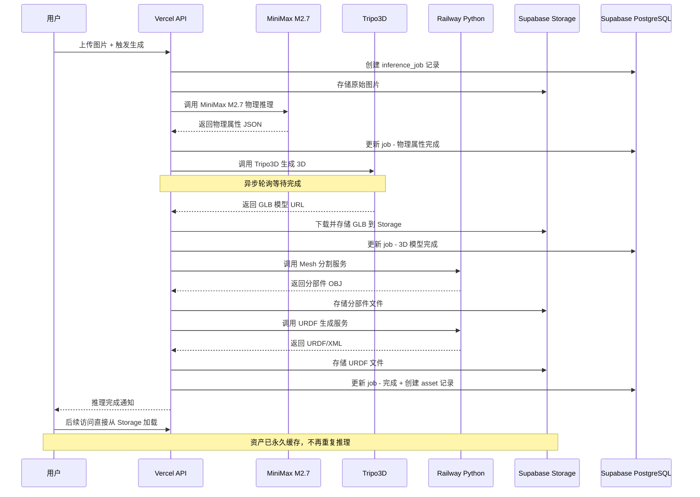

# Current - 工业地图与物理引擎 架构设计文档 V2

> **核心变更**：采用云端多模态模型 API（MiniMax M2.7-highspeed）替代本地 GPU 推理，所有生成的资产永久缓存到 Supabase Storage，实现零 GPU 基础设施的轻量部署。

---

## 1. 流水线云端化分析

### 1.1 原始流水线（PhysX-Anything）4 步拆解

| 步骤 | 原始实现 | GPU 需求 | 云端替代方案 | 可行性 |
|------|----------|----------|-------------|--------|
| **Step 1** VLM 物理推理 | Qwen2.5-VL-7B 微调模型 | 16GB+ VRAM | MiniMax M2.7-highspeed API | ✅ 高 |
| **Step 2** 3D Mesh 生成 | TRELLIS `run_control` | 24GB+ VRAM | Tripo3D / Meshy / Replicate | ✅ 中高 |
| **Step 3** Mesh 部件分割 | trimesh + scipy 测地线传播 | CPU only | Vercel Serverless | ✅ 高 |
| **Step 4** URDF/MJCF 生成 | 纯 Python 计算 | CPU only | Vercel Serverless | ✅ 高 |

### 1.2 云端化后的新流水线



### 1.3 各步骤云端方案详解

#### Step 1: VLM 物理属性推理 → MiniMax M2.7-highspeed API

**原始代码**：[`1_vlm_demo.py`](1_vlm_demo.py) 使用微调的 Qwen2.5-VL-7B

**改造方案**：
- 使用 MiniMax M2.7-highspeed 的多模态 API（兼容 OpenAI 格式）
- 将 [`dataset/overall_prompt.txt`](dataset/overall_prompt.txt) 的 prompt 模板直接发送给 API
- API 返回结构化文本，解析为 JSON

**关键差异处理**：
- 原始模型输出包含 voxel grid 索引（体素坐标），云端 VLM 可能无法精确预测
- **解决方案**：将 voxel grid 预测改为可选步骤，核心物理属性（密度、摩擦系数、质量、关节类型）由 VLM 推理，3D 几何由 Step 2 的专业 3D API 生成

```typescript
// MiniMax M2.7-highspeed API 调用（兼容 OpenAI 格式）
const response = await fetch('https://api.minimax.chat/v1/text/chatcompletion_v2', {
  method: 'POST',
  headers: {
    'Authorization': `Bearer ${process.env.MINIMAX_API_KEY}`,
    'Content-Type': 'application/json',
  },
  body: JSON.stringify({
    model: 'M2.7-highspeed',
    messages: [{
      role: 'user',
      content: [
        { type: 'image_url', image_url: { url: image_url } },
        { type: 'text', text: PHYSICAL_PROMPT },
      ],
    }],
    temperature: 0.1,
    max_tokens: 2048,
  }),
})
```

**精简版 Prompt**（去除 voxel grid 要求，专注物理属性）：
```
请分析给定图片中的物体，输出结构化描述：
Name: <物体名称>
Category: <物体类别>
Dimension: <物理尺寸，单位cm，如 50*40*30>
Parts:
l_0: <部件名>, <材料>, <密度 kg/m3>, <杨氏模量 GPa>, <泊松比>, <描述>
l_1: ...
Group_info:
group_0: [l_0, ...] (child); Type: E; Params: N/A
group_1: [l_1, ...] (child); Type: C relative to group_0 (parent); Params: direction: [x,y,z], axis position: [x,y,z], revolute range (degree): [min,max]
```

#### Step 2: 3D Mesh 生成 → Tripo3D API

**原始代码**：[`2_decoder.py`](2_decoder.py) 使用 TRELLIS

**候选云端 3D 生成 API**：

| 服务 | API 质量 | 价格 | 物理属性支持 |
|------|---------|------|-------------|
| **Tripo3D** (tripo3d.ai) | ⭐⭐⭐⭐ | ~$0.05/次 | 无，需后处理添加 |
| **Meshy** (meshy.ai) | ⭐⭐⭐⭐ | ~$0.03/次 | 无，需后处理添加 |
| **CSM AI** (csm.ai) | ⭐⭐⭐ | ~$0.02/次 | 支持骨骼绑定 |
| **Replicate** (自托管 TRELLIS) | ⭐⭐⭐⭐⭐ | ~$0.10/次 | 完全兼容原流水线 |

**推荐方案**：MVP 使用 Tripo3D API（性价比最优），后续可切换到 Replicate 自托管 TRELLIS 获得最佳质量。

```python
# Tripo3D API 调用示例
import httpx

async def generate_3d_model(image_url: str) -> str:
    # 1. 提交任务
    task = await httpx.post("https://api.tripo3d.ai/v2/openapi/task", 
        headers={"Authorization": f"Bearer {API_KEY}"},
        json={"type": "image_to_model", "content": {"image": image_url}}
    )
    task_id = task.json()["data"]["task_id"]
    
    # 2. 轮询等待完成
    while True:
        status = await httpx.get(f"https://api.tripo3d.ai/v2/openapi/task/{task_id}",
            headers={"Authorization": f"Bearer {API_KEY}"})
        if status.json()["data"]["status"] == "success":
            return status.json()["data"]["output"]["model"]  # GLB URL
        await asyncio.sleep(2)
```

#### Step 3 & 4: 后处理 → Vercel Serverless Functions

**原始代码**：[`3_split.py`](3_split.py) + [`4_simready_gen.py`](4_simready_gen.py)

这两步是纯 CPU 计算，可以直接部署为 Vercel Serverless Functions：

```
app/api/
├── inference/
│   ├── upload/route.ts        # 上传图片 → 触发流水线
│   ├── vlm/route.ts           # 调用 MiniMax API → 返回物理属性
│   ├── generate-3d/route.ts   # 调用 Tripo3D API → 返回 GLB
│   ├── split-mesh/route.ts    # Mesh 分割（Python 微服务或 WASM）
│   ├── generate-urdf/route.ts # URDF 生成
│   └── [jobId]/route.ts       # 查询任务状态
```

> **注意**：Step 3（mesh 分割）依赖 `trimesh`、`scipy` 等 Python 库，有两个部署选项：
> 1. **Supabase Edge Functions**（Deno）— 需要用 TypeScript 重写分割算法
> 2. **轻量 Python 微服务**（Railway / Fly.io）— 直接复用现有 Python 代码
> 
> **推荐**：MVP 先用 Railway 部署 Python 微服务，后续优化时考虑 WASM 移植。

---

## 2. 更新后的系统架构

### 2.1 整体架构图



### 2.2 资产生成与缓存流程



---

## 3. 成本分析

### 3.1 云端 API 成本（按资产生成计）

| 服务 | 单次调用成本 | 备注 |
|------|-------------|------|
| MiniMax M2.7-highspeed | ~¥0.03/次 | 图片 + 长文本输出 |
| Tripo3D API | ~¥0.35/次 | Image to 3D GLB |
| Railway Python 微服务 | ~$5/月 | 固定费用，不限调用次数 |
| **单资产生成总成本** | **~¥0.40** | **一次性，后续访问免费** |

### 3.2 基础设施月成本

| 服务 | 方案 | 月成本 |
|------|------|--------|
| Vercel | Pro Plan | $20/月 |
| Supabase | Pro Plan | $25/月 |
| Railway | Python 微服务 | $5/月 |
| MiniMax API | 按量付费 | ~¥30-100/月 |
| Tripo3D API | 按量付费 | ~¥100-500/月 |
| **总计** | | **~$50-80/月 + API 按量** |

对比自建 GPU 方案（A100 服务器 ~$1000-2000/月），节省 **90%+** 成本。

---

## 4. 前端项目结构（不变）

与 V1 版本相同，详见 [`plans/architecture.md`](plans/architecture.md) 第 4 节。

---

## 5. 推理服务项目结构（精简版）

```
current-inference/                    # Python 微服务 - Railway 部署
├── main.py                           # FastAPI 入口
├── requirements.txt                  # 精简依赖（无 torch/transformers）
├── routers/
│   ├── split.py                      # Mesh 分割 API
│   └── urdf.py                       # URDF 生成 API
├── services/
│   ├── mesh_splitter.py              # 封装 3_split.py
│   └── urdf_generator.py             # 封装 4_simready_gen.py
├── models/
│   └── schemas.py                    # Pydantic 模型
└── core/
    └── config.py                     # 配置
```

> **关键变化**：不再需要 `trellis/`、`pretrain/`、VLM 推理代码。只保留 CPU 密集型的后处理步骤。

---

## 6. 保留与删除清单（更新版）

### ✅ 保留并改造

| 文件 | 改造方式 |
|------|----------|
| `3_split.py` | 重构为 FastAPI 的 mesh 分割服务 |
| `4_simready_gen.py` | 重构为 FastAPI 的 URDF 生成服务 |
| `dataset/overall_prompt.txt` | 精简后作为 MiniMax API 的 prompt 模板 |

### ❌ 删除（不再需要）

| 文件/目录 | 原因 |
|-----------|------|
| `1_vlm_demo.py` | 由 MiniMax M2.7-highspeed API 替代 |
| `2_decoder.py` | 由 Tripo3D API 替代 |
| `trellis/` | 不再需要本地 3D 生成引擎 |
| `qwen-vl-finetune/` | 不再需要 VLM 微调 |
| `qwen-vl-utils/` | 不再需要 Qwen 工具 |
| `download.py` | 不再需要下载模型权重 |
| `configs/` | 训练配置 |
| `dataset/` (除 prompt) | 训练数据准备 |
| `dataset_toolkits/` | Blender 渲染 |
| `evaluation_*.py` | 评估脚本 |
| `render_urdf.py` | URDF 渲染 |
| `demo/`、`evaluation_video/`、`mjcf_source/` | 测试/演示文件 |
| `testset.npy`、`trainingset.npy` | 训练数据 |
| `setup.sh` | 环境安装 |
| `requirements.txt` | 替换为精简版 |

### ➕ 新增

| 内容 | 说明 |
|------|------|
| `current-web/` | Next.js 15 前端项目 |
| `current-inference/` | Python FastAPI 后处理微服务 |
| `supabase/` | 数据库迁移 + 种子数据 |

---

## 7. MVP 开发路线图（更新版）

### Phase 1: 基础框架搭建

- [ ] 初始化 Next.js 15 项目（App Router + TypeScript + Tailwind + shadcn/ui）
- [ ] 配置 Supabase 项目（数据库 Schema + Auth + Storage Buckets）
- [ ] 实现基础布局（三栏式：资产列表 / 主内容区 / 属性面板）
- [ ] 实现用户认证（Supabase Auth）
- [ ] 实现项目管理 CRUD

### Phase 2: 3D 资产库 + 云端推理集成

- [ ] 实现 3D 模型检视器（React Three Fiber）
- [ ] 实现资产列表页（搜索、分类筛选、缩略图）
- [ ] 实现图片上传 + MiniMax M2.7-highspeed API 调用（物理属性推理）
- [ ] 实现 Tripo3D API 集成（3D 模型生成）
- [ ] 部署 Python 微服务到 Railway（mesh 分割 + URDF 生成）
- [ ] 实现完整流水线编排（上传 → VLM → 3D → 分割 → URDF → 入库）
- [ ] 实现资产属性面板（物理参数展示 + 编辑）
- [ ] 实现资产缓存策略（生成一次，永久复用）

### Phase 3: 2D 地图编辑器

- [ ] 实现 Fabric.js Canvas 编辑器基础框架
- [ ] 实现底图导入（DXF via dxf-parser / PDF via pdf.js / JPEG）
- [ ] 实现比例尺标定向导（画线段 → 输入真实距离 → 计算比例）
- [ ] 实现多图层管理（底图层 / 限域层 / 路径层）
- [ ] 实现障碍区域绘制（多边形工具 + 标记为不可通行）
- [ ] 实现路径绘制工具（直线段 + 贝塞尔曲线）
- [ ] 实现路段属性编辑（限速 / 单双向 / 互斥区标记）

### Phase 4: 路径规划与仿真

- [ ] 实现加权 A* 路径规划算法（TypeScript）
- [ ] 实现路径可视化（起终点拖拽 + 最优路径高亮 + 预计用时）
- [ ] 实现轻量级离散事件仿真引擎
- [ ] 实现仿真时间轴控制（播放 / 暂停 / 1x-10x 倍速）
- [ ] 实现 3D 热力图可视化（路段拥堵度）
- [ ] 实现 2D 数据看板（AGV 稼动率 / 吞吐量 / 阻塞状态）

### Phase 5: 集成与优化

- [ ] 3D 资产从库中拖拽放入 2D 地图场景
- [ ] 动态真实调度模式（RCS 逻辑模拟）
- [ ] 业务逻辑任务编排（卡片式 If-Action-Execute）
- [ ] 性能优化（Web Worker 路径规划 + 虚拟滚动资产列表）
- [ ] 部署到生产环境（Vercel + Supabase + Railway）

---

## 8. 核心优势总结

| 维度 | 自建 GPU 方案 | 云端 API 方案（本方案） |
|------|--------------|----------------------|
| **启动成本** | ~$1000/月 GPU 服务器 | ~$50/月基础设施 |
| **运维复杂度** | 需管理 CUDA/驱动/模型加载 | 零运维 |
| **扩展性** | 受 GPU 数量限制 | API 按需扩展 |
| **资产生成成本** | 固定成本（无论是否使用） | ~¥0.40/资产（一次性） |
| **后续访问成本** | 免费 | 免费（缓存策略） |
| **部署速度** | 数天（环境配置） | 数小时（API 集成） |
| **质量** | ⭐⭐⭐⭐⭐（原始流水线） | ⭐⭐⭐⭐（云端 API） |

**推荐策略**：MVP 阶段使用云端 API 快速验证产品价值，后续根据用户反馈决定是否需要自建 GPU 推理服务以提升质量。
