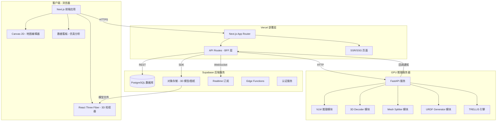
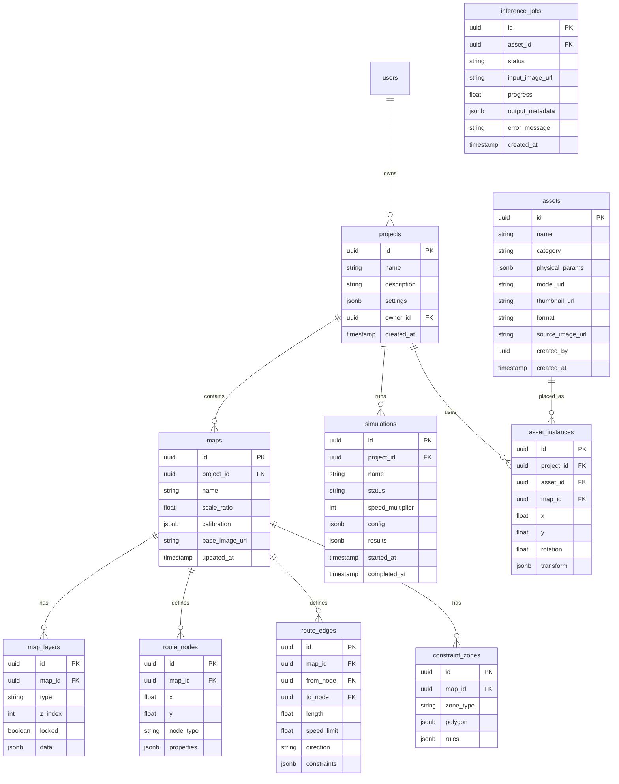
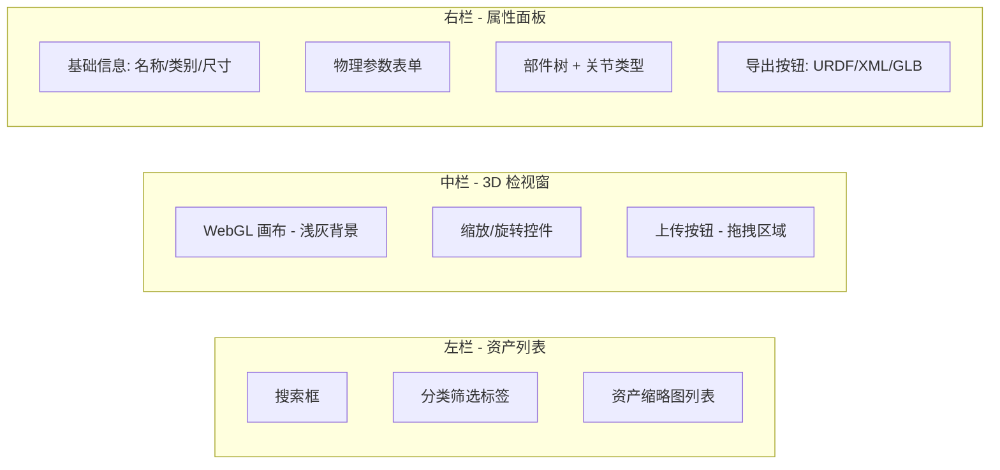
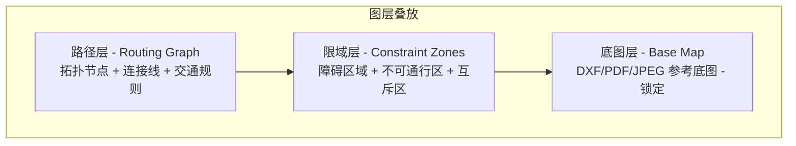
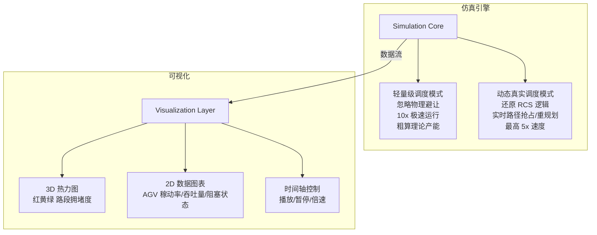
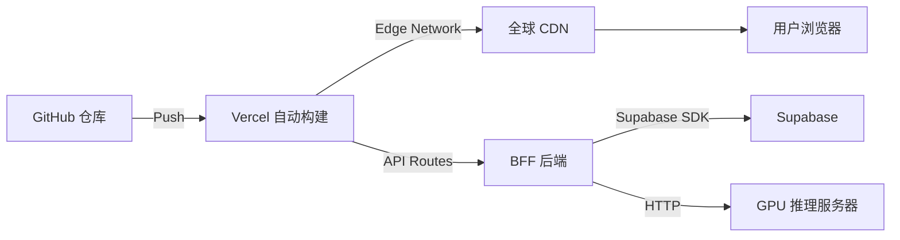

# Current - 工业地图与物理引擎 架构设计文档

## 1. 代码审查总结

### 1.1 现有仓库分析

当前仓库是 **PhysX-Anything** (CVPR 2026) 的 fork，这是一个从单张 RGB 图片生成仿真就绪（Sim-Ready）3D 物理资产的研究项目。

#### 核心推理流水线（4步）

| 步骤 | 脚本 | 功能 | 输入 | 输出 |
|------|------|------|------|------|
| 1 | `1_vlm_demo.py` | VLM 视觉语言模型推理 | RGB 图片 | 结构化描述 + 部件体素网格 |
| 2 | `2_decoder.py` | TRELLIS 3D 解码 | 体素 + 图片 | GLB 3D 模型 |
| 3 | `3_split.py` | Mesh 部件分割 | GLB + 体素标签 | 分部件 OBJ 文件 |
| 4 | `4_simready_gen.py` | 仿真资产生成 | 分部件 OBJ + 物理参数 | URDF/MJCF XML |

#### 关键模块

- **`trellis/`** - Microsoft TRELLIS 3D 生成框架（VAE、Flow Matching、渲染器）
- **`qwen-vl-finetune/`** - Qwen2.5-VL 微调代码
- **`qwen-vl-utils/`** - 视觉处理工具
- **`dataset/`** - 训练数据准备脚本
- **`dataset_toolkits/`** - Blender 渲染脚本

### 1.2 保留与删除清单

#### ✅ 保留（核心推理能力）

| 文件/目录 | 用途 |
|-----------|------|
| `1_vlm_demo.py` | VLM 推理核心 - 需重构为 API 服务 |
| `2_decoder.py` | 3D 解码核心 - 需重构为 API 服务 |
| `3_split.py` | Mesh 分割算法 - 需重构为 API 服务 |
| `4_simready_gen.py` | URDF/MJCF 生成 - 需重构为 API 服务 |
| `trellis/` | TRELLIS 框架 - 3D 生成引擎 |
| `qwen-vl-utils/` | 视觉处理工具库 |
| `dataset/overall_prompt.txt` | VLM Prompt 模板 |
| `download.py` | 模型下载脚本 |
| `requirements.txt` | Python 依赖参考 |

#### ❌ 删除（训练/评估/演示相关）

| 文件/目录 | 原因 |
|-----------|------|
| `qwen-vl-finetune/` | 模型微调代码，仅推理不需要 |
| `dataset/1voxel_*.py` | 训练数据预处理 |
| `dataset/2encode_*.py` | 训练数据编码 |
| `dataset/3generate_*.py` | 训练数据生成 |
| `dataset/training_data_template.json` | 训练数据模板 |
| `dataset_toolkits/` | Blender 渲染工具 |
| `evaluation_kine.py` | 运动学评估 |
| `evaluation_phy.py` | 物理评估 |
| `render_urdf.py` | URDF 渲染 |
| `evaluation_video/` | 评估视频 |
| `demo/` | 演示图片 |
| `testset.npy` | 测试集数据 |
| `trainingset.npy` | 训练集数据 |
| `mjcf_source/` | MuJoCo 源资产 |
| `configs/` | 训练配置文件 |
| `setup.sh` | 环境安装脚本 |

---

## 2. 系统架构设计

### 2.1 整体架构图



### 2.2 技术栈选型

| 层级 | 技术 | 选型理由 |
|------|------|----------|
| **前端框架** | Next.js 15 + App Router | SSR、API Routes 一体化，Vercel 原生支持 |
| **UI 框架** | Tailwind CSS + shadcn/ui | 工业极简美学，高度可定制 |
| **3D 渲染** | React Three Fiber + drei | React 生态最成熟的 Three.js 封装 |
| **2D 编辑器** | Fabric.js | Canvas 操作、图层管理、DXF 渲染能力强 |
| **CAD 解析** | dxf-parser + opencascade.js | DXF 解析 + 高级 CAD 特征识别 |
| **路径规划** | 自实现 A*/Dijkstra | 轻量级，无需后端依赖 |
| **图表可视化** | Recharts | React 原生，轻量级数据看板 |
| **状态管理** | Zustand | 轻量、TypeScript 友好 |
| **后端服务** | Supabase | PostgreSQL + Auth + Storage + Realtime 一体化 |
| **推理服务** | FastAPI + Python | 保持与现有 PhysX-Anything 代码兼容 |
| **前端部署** | Vercel | Next.js 原生，零配置部署 |
| **推理部署** | GPU 云服务器 | RunPod / AWS EC2 / 自建 |

### 2.3 数据库设计（Supabase PostgreSQL）



---

## 3. 模块详细设计

### 3.1 模块一：3D 物理资产库生成流水线

#### 前端界面



#### 推理服务 API 设计

```
POST /api/v1/inference/upload
  - 上传图片，创建推理任务
  - 返回 job_id

GET /api/v1/inference/status/:job_id
  - 查询推理进度
  - 返回 status + progress + result_url

GET /api/v1/inference/result/:job_id
  - 获取推理结果
  - 返回 3D 模型 URL + 物理参数 JSON
```

#### 推理流水线改造

将现有的 4 个独立脚本重构为模块化的 FastAPI 服务：

```python
# inference_service/
# ├── main.py              # FastAPI 入口
# ├── routers/
# │   └── inference.py     # 推理 API 路由
# ├── services/
# │   ├── vlm_service.py   # 封装 1_vlm_demo.py
# │   ├── decoder_service.py # 封装 2_decoder.py
# │   ├── splitter_service.py # 封装 3_split.py
# │   └── urdf_service.py  # 封装 4_simready_gen.py
# ├── models/
# │   └── schemas.py       # Pydantic 数据模型
# └── core/
#     ├── pipeline.py      # 流水线编排
#     └── config.py        # 配置管理
```

### 3.2 模块二：地图初始化与路网编辑器

#### 图层架构



#### 核心功能实现

1. **底图导入与比例尺标定**
   - 使用 `dxf-parser` 解析 DXF 文件
   - PDF 使用 `pdf.js` 渲染为 Canvas
   - JPEG 直接加载
   - 标定向导：用户画线段 → 输入真实距离 → 计算比例尺

2. **路径绘制工具**
   - 直线段绘制
   - 贝塞尔曲线绘制
   - 节点自动吸附（Snap）
   - 路段属性编辑（限速、方向、互斥区）

3. **A* 路径规划**
   - 基于限域层构建障碍栅格
   - 实现加权 A* 算法
   - 支持限速约束的最短时间路径
   - 实时显示预计行驶用时

### 3.3 模块三：仿真引擎与可视化分析

#### 仿真架构



#### 仿真核心逻辑（TypeScript 实现）

```typescript
// 轻量级仿真 - 离散事件模拟
interface SimulationConfig {
  agvs: AGV[]
  tasks: Task[]
  routeGraph: RouteGraph
  speedMultiplier: number
  mode: 'lightweight' | 'dynamic'
}

// 核心循环
interface SimulationEngine {
  tick(deltaTime: number): SimulationState
  getAGVPositions(): Map<string, Position>
  getHeatmapData(): HeatmapData
  getMetrics(): SimulationMetrics
}
```

---

## 4. 前端项目结构

```
current-web/
├── app/
│   ├── layout.tsx                    # 根布局
│   ├── page.tsx                      # 首页/项目列表
│   ├── (auth)/
│   │   ├── login/page.tsx
│   │   └── register/page.tsx
│   ├── projects/[id]/
│   │   ├── page.tsx                  # 项目概览
│   │   ├── assets/
│   │   │   ├── page.tsx              # 资产库列表
│   │   │   ├── [assetId]/page.tsx    # 资产详情/3D 检视
│   │   │   └── new/page.tsx          # 上传图片创建资产
│   │   ├── map/
│   │   │   └── page.tsx              # 2D 地图编辑器
│   │   ├── simulation/
│   │   │   └── page.tsx              # 仿真运行与分析
│   │   └── settings/page.tsx         # 项目设置
│   └── api/
│       ├── assets/
│       │   ├── route.ts              # GET 列表 / POST 创建
│       │   └── [id]/route.ts         # GET/PUT/DELETE
│       ├── inference/
│       │   ├── upload/route.ts       # POST 上传图片
│       │   └── [jobId]/route.ts      # GET 推理状态
│       ├── maps/
│       │   ├── route.ts
│       │   └── [id]/
│       │       ├── route.ts
│       │       ├── nodes/route.ts
│       │       ├── edges/route.ts
│       │       └── zones/route.ts
│       ├── pathfinding/route.ts      # POST 路径规划
│       └── simulations/
│           ├── route.ts
│           └── [id]/route.ts
├── components/
│   ├── ui/                           # shadcn/ui 基础组件
│   ├── viewer-3d/
│   │   ├── ModelViewer.tsx           # 3D 模型检视器
│   │   ├── AssetCard.tsx             # 资产卡片
│   │   └── PhysicsPanel.tsx          # 物理属性面板
│   ├── editor-2d/
│   │   ├── MapEditor.tsx             # 地图编辑器主组件
│   │   ├── LayerManager.tsx          # 图层管理器
│   │   ├── DrawingToolbar.tsx        # 绘图工具栏
│   │   ├── CalibrationWizard.tsx     # 比例尺标定向导
│   │   ├── RouteEditor.tsx           # 路径编辑器
│   │   └── PropertyPanel.tsx         # 属性面板
│   └── simulation/
│       ├── SimulationPlayer.tsx      # 仿真播放器
│       ├── HeatmapOverlay.tsx        # 热力图叠加层
│       ├── MetricsDashboard.tsx      # 数据看板
│       └── TimelineControl.tsx       # 时间轴控制
├── lib/
│   ├── supabase/
│   │   ├── client.ts                 # Supabase 客户端
│   │   ├── server.ts                 # Supabase 服务端客户端
│   │   └── middleware.ts             # Auth 中间件
│   ├── pathfinding/
│   │   ├── astar.ts                  # A* 算法实现
│   │   ├── graph.ts                  # 路网图数据结构
│   │   └── types.ts                  # 类型定义
│   ├── simulation/
│   │   ├── engine.ts                 # 仿真引擎核心
│   │   ├── lightweight.ts            # 轻量级调度器
│   │   ├── dynamic.ts                # 动态真实调度器
│   │   └── types.ts                  # 类型定义
│   ├── cad/
│   │   ├── dxf-parser.ts             # DXF 解析器
│   │   └── scale-calibrator.ts       # 比例尺标定
│   └── utils/
│       ├── format.ts                 # 格式化工具
│       └── constants.ts              # 常量定义
├── hooks/
│   ├── use-supabase.ts
│   ├── use-asset.ts
│   ├── use-map-editor.ts
│   └── use-simulation.ts
├── stores/
│   ├── asset-store.ts                # Zustand 资产状态
│   ├── editor-store.ts               # Zustand 编辑器状态
│   └── simulation-store.ts           # Zustand 仿真状态
├── public/
│   └── models/                       # 内置标准模型（AGV、货架等）
├── supabase/
│   ├── migrations/                   # 数据库迁移文件
│   └── seed.sql                      # 种子数据
├── next.config.ts
├── tailwind.config.ts
├── tsconfig.json
└── package.json
```

---

## 5. 推理服务项目结构（Python）

```
current-inference/
├── main.py                           # FastAPI 入口
├── requirements.txt                  # Python 依赖（精简版）
├── routers/
│   ├── inference.py                  # 推理 API 路由
│   └── health.py                     # 健康检查
├── services/
│   ├── pipeline.py                   # 流水线编排
│   ├── vlm_service.py                # VLM 推理（封装 1_vlm_demo.py）
│   ├── decoder_service.py            # 3D 解码（封装 2_decoder.py）
│   ├── splitter_service.py           # Mesh 分割（封装 3_split.py）
│   └── urdf_service.py              # URDF 生成（封装 4_simready_gen.py）
├── models/
│   ├── schemas.py                    # Pydantic 数据模型
│   └── asset.py                      # 资产数据模型
├── core/
│   ├── config.py                     # 配置管理
│   └── storage.py                    # Supabase Storage 集成
├── trellis/                          # TRELLIS 框架（保留原样）
├── prompts/
│   └── overall_prompt.txt            # VLM Prompt 模板
└── pretrain/                         # 预训练模型（gitignore）
```

---

## 6. 部署方案

### 6.1 Vercel 部署（前端）



**配置要点：**
- 环境变量：`NEXT_PUBLIC_SUPABASE_URL`、`NEXT_PUBLIC_SUPABASE_ANON_KEY`、`INFERENCE_API_URL`
- 构建命令：`next build`
- 输出目录：`.next`
- Node.js 18+

### 6.2 Supabase 配置

| 服务 | 用途 | 配置 |
|------|------|------|
| **PostgreSQL** | 主数据库 | 免费版 500MB 足够 MVP |
| **Auth** | 用户认证 | Email + OAuth |
| **Storage** | 文件存储 | 3D 模型、图片、DXF 文件 |
| **Realtime** | 实时通知 | 推理进度、仿真状态推送 |
| **Edge Functions** | 轻量计算 | 文件格式转换、缩略图生成 |

**Storage Bucket 设计：**
- `assets/models/` - GLB/OBJ 3D 模型文件
- `assets/thumbnails/` - 模型缩略图
- `assets/urdf/` - URDF/XML 仿真文件
- `maps/base-images/` - 底图文件（DXF/PDF/JPEG）
- `inference/input/` - 推理输入图片
- `inference/output/` - 推理输出结果

### 6.3 GPU 推理服务器部署

**推荐方案：RunPod Serverless**

| 配置项 | 推荐 |
|--------|------|
| GPU | NVIDIA A100 40GB 或 L4 24GB |
| 内存 | 32GB+ |
| 存储 | 100GB+（模型权重约 20GB） |
| 框架 | FastAPI + Uvicorn |
| 并发 | 单请求串行处理（GPU 显存限制） |

**启动流程：**
1. 拉取模型权重（Qwen2.5-VL-7B + TRELLIS）
2. 预加载模型到 GPU
3. 启动 FastAPI 服务
4. 注册到 Vercel API Routes 的环境变量

---

## 7. MVP 开发路线图

### Phase 1: 基础框架搭建

- [ ] 初始化 Next.js 15 项目（App Router + TypeScript + Tailwind）
- [ ] 配置 Supabase 项目（数据库 + Auth + Storage）
- [ ] 实现基础布局（侧边栏 + 顶栏 + 内容区）
- [ ] 实现用户认证（登录/注册）
- [ ] 实现项目管理 CRUD

### Phase 2: 3D 资产库模块

- [ ] 实现 3D 模型检视器（React Three Fiber）
- [ ] 实现资产列表页（搜索、筛选、分页）
- [ ] 实现资产属性面板（物理参数表单）
- [ ] 重构推理流水线为 FastAPI 服务
- [ ] 实现图片上传 → 推理 → 资产生成的完整流程
- [ ] 实现 URDF/GLB 文件导出

### Phase 3: 2D 地图编辑器

- [ ] 实现 Canvas 2D 编辑器基础框架
- [ ] 实现底图导入（DXF/PDF/JPEG）
- [ ] 实现比例尺标定向导
- [ ] 实现多图层管理（底图/限域/路径）
- [ ] 实现障碍区域绘制（多边形工具）
- [ ] 实现路径绘制（直线 + 贝塞尔曲线）
- [ ] 实现路段属性编辑（限速/方向/互斥区）

### Phase 4: 路径规划与仿真

- [ ] 实现 A* 路径规划算法
- [ ] 实现路径可视化（起终点选择 + 最优路径显示）
- [ ] 实现轻量级仿真引擎（离散事件模拟）
- [ ] 实现仿真时间轴控制（播放/暂停/倍速）
- [ ] 实现 3D 热力图可视化
- [ ] 实现 2D 数据看板（稼动率/吞吐量/阻塞状态）

### Phase 5: 集成与优化

- [ ] 3D 资产拖拽放入 2D 地图
- [ ] 动态真实调度模式（RCS 逻辑模拟）
- [ ] 业务逻辑任务编排（卡片式）
- [ ] 性能优化与错误处理
- [ ] 部署到 Vercel + Supabase 生产环境

---

## 8. 关键依赖包

### 前端（package.json 核心）

```json
{
  "dependencies": {
    "next": "^15.0.0",
    "react": "^19.0.0",
    "react-dom": "^19.0.0",
    "@supabase/supabase-js": "^2.45.0",
    "@react-three/fiber": "^8.17.0",
    "@react-three/drei": "^9.114.0",
    "three": "^0.170.0",
    "fabric": "^6.5.0",
    "zustand": "^5.0.0",
    "recharts": "^2.15.0",
    "dxf-parser": "^1.1.2",
    "tailwindcss": "^4.0.0",
    "@radix-ui/react-*": "latest",
    "lucide-react": "^0.460.0"
  }
}
```

### 推理服务（requirements.txt 精简版）

```
fastapi>=0.115.0
uvicorn>=0.32.0
python-multipart>=0.0.12
torch>=2.5.0
transformers>=4.50.0
accelerate>=0.26.0
qwen-vl-utils
trimesh>=4.5.0
scipy>=1.14.0
numpy>=1.26.0
Pillow>=11.0.0
rembg>=2.0.50
spconv-cu118>=2.3.0
flash-attn>=2.5.0
huggingface-hub>=0.26.0
supabase>=2.0.0
```

---

## 9. 安全与性能考量

### 安全
- Supabase RLS（Row Level Security）确保数据隔离
- API Routes 验证用户身份后才代理请求到推理服务
- 推理服务不直接暴露公网，通过 Vercel API Routes 中转
- 文件上传大小限制（图片 10MB，DXF 50MB）

### 性能
- 3D 模型使用 GLB 格式（压缩后加载快）
- 地图编辑器使用 Canvas 离屏渲染优化
- 路径规划使用 Web Worker 避免阻塞 UI
- Supabase Realtime 推送推理进度（避免轮询）
- Vercel Edge Cache 缓存静态资产

---

## 10. 总结

本架构设计的核心思路是：

1. **前端与推理解耦** - Next.js 前端部署在 Vercel（免费/低成本），GPU 推理服务独立部署（按需付费）
2. **Supabase 一站式后端** - 数据库、认证、存储、实时推送一体化，极大减少后端开发量
3. **保留核心 AI 能力** - PhysX-Anything 的推理流水线完整保留，重构为 API 服务
4. **渐进式开发** - MVP 聚焦于 2D 地图编辑器 + 路径规划，3D 资产生成作为增强功能
5. **工业极简美学** - 去除一切装饰性元素，专注功能性和数据密度
