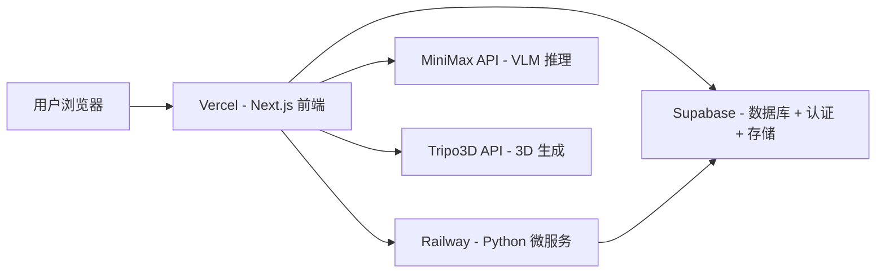
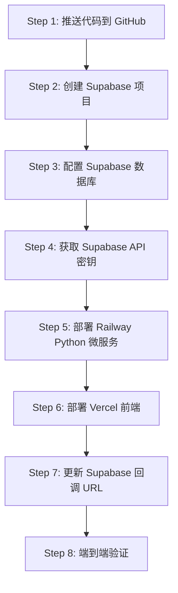

# Current — 生产部署完整指南

> **目标**: 将 Current 部署到 Supabase + Railway + Vercel 三平台。
> **月成本**: ~$30-55 + API 按量付费。
> **难度**: ⭐⭐☆☆☆（中等，需要注册 3 个平台账号）

---

## 部署架构总览



## 部署顺序

> ⚠️ **重要**: 必须按以下顺序部署，因为后续步骤依赖前一步的信息。



---

## 前置条件

在开始之前，确保你拥有以下账号和密钥：

| 账号/密钥 | 注册地址 | 用途 |
|-----------|---------|------|
| GitHub 账号 | [github.com](https://github.com) | 代码托管 + CI/CD |
| Supabase 账号 | [supabase.com](https://supabase.com) | 数据库 + 认证 + 文件存储 |
| Vercel 账号 | [vercel.com](https://vercel.com) | 前端托管（可 GitHub 登录） |
| Railway 账号 | [railway.app](https://railway.app) | Python 微服务托管 |
| MiniMax API Key | [platform.minimax.chat](https://platform.minimax.chat) | VLM 物理属性推理 |
| Tripo3D API Key | [platform.tripo3d.ai](https://platform.tripo3d.ai) | 照片转 3D 模型 |

---

## Step 1: 推送代码到 GitHub

### 1.1 创建 GitHub 仓库

1. 登录 [github.com](https://github.com)
2. 点击右上角 **+** → **New repository**
3. 填写信息：
   - Repository name: `Current`
   - Description: `Industrial Map & Physics Engine — AGV/Warehouse Automation Planning Platform`
   - Visibility: **Private**（推荐，因为包含 API 密钥配置模板）
4. 点击 **Create repository**

### 1.2 推送代码

```bash
cd /path/to/Current

# 如果还没有设置远程地址
git remote set-url origin https://github.com/<your-username>/Current.git

# 推送到 GitHub
git push -u origin main
```

### 1.3 验证

- 访问 `https://github.com/<your-username>/Current`
- 确认能看到以下目录：`current-web/`、`current-inference/`、`plans/`
- 确认 `.env.local` 文件 **不在** 仓库中（被 .gitignore 排除）

---

## Step 2: 创建 Supabase 项目

### 2.1 创建项目

1. 登录 [supabase.com](https://supabase.com)
2. 点击 **New Project**
3. 填写配置：

| 字段 | 推荐值 | 说明 |
|------|--------|------|
| Project Name | `current-production` | 项目标识 |
| Database Password | 生成强密码并**保存到密码管理器** | ⚠️ 无法找回！ |
| Region | Northeast Asia (Tokyo) 或 Southeast Asia (Singapore) | 选离用户最近的 |
| Plan | Pro ($25/月) | 需要 Storage 和 Point-in-Time Recovery |

4. 点击 **Create new project**
5. 等待约 2 分钟，项目初始化完成

### 2.2 获取 Project URL

1. 进入项目 → **Settings** ⚙️ → **General**
2. 找到 **Project URL**，格式如 `https://abcdefghijk.supabase.co`
3. 记录下来，后面会用到

---

## Step 3: 配置 Supabase 数据库

### 3.1 执行数据库 Schema

1. 进入项目 → 左侧菜单 → **SQL Editor**
2. 点击 **New query**
3. 打开本地文件 [`current-web/supabase/migrations/001_initial_schema.sql`](current-web/supabase/migrations/001_initial_schema.sql)
4. 复制**全部内容**粘贴到 SQL Editor
5. 点击 **Run**（或按 `Ctrl+Enter`）

**预期结果**: 显示 "Success" 消息。

**验证**: 左侧菜单 → **Table Editor**，应看到以下 10 张表：

| 表名 | 用途 |
|------|------|
| `projects` | 项目管理 |
| `assets` | 3D 物理资产库 |
| `maps` | 工业地图 |
| `asset_instances` | 地图上放置的资产实例 |
| `map_layers` | 地图图层 |
| `route_nodes` | 路径节点 |
| `route_edges` | 路径路段 |
| `constraint_zones` | 限域区域 |
| `simulations` | 仿真记录 |
| `inference_jobs` | AI 推理任务 |

### 3.2 配置 Authentication

1. 左侧菜单 → **Authentication** → **Providers**
2. 确认 **Email** 已启用（默认开启）
3. 展开 Email → 确认 **Confirm email** 设置符合需求
   - 开发阶段可关闭 "Enable email confirmations" 以便快速测试
   - 生产环境建议开启

### 3.3 创建 Storage Bucket

1. 左侧菜单 → **Storage**
2. 点击 **New bucket**
3. 配置：
   - Name: `assets`
   - Public bucket: **关闭** ❌（通过 API + RLS 控制访问）
   - File size limit: `50 MB`
4. 点击 **Create bucket**

### 3.4 配置 Storage 策略

1. Storage → 点击 `assets` bucket → **Policies** 标签
2. 点击 **New Policy** → **For full customization**
3. 添加以下两条策略：

**策略 1 — 用户查看自己的资产**:
```sql
-- Policy name: Users can view own assets
-- Allowed operation: SELECT
-- Target roles: authenticated
-- USING expression:
auth.uid()::text = (storage.foldername(name))[1]
```

**策略 2 — 用户上传资产**:
```sql
-- Policy name: Users can upload assets
-- Allowed operation: INSERT
-- Target roles: authenticated
-- WITH CHECK expression:
auth.uid()::text = (storage.foldername(name))[1]
```

---

## Step 4: 获取 Supabase API 密钥

> ⚠️ Supabase 已更新密钥系统，使用新的 `sb_publishable_`/`sb_secret_` 格式替代旧的 JWT `anon`/`service_role`。

### 4.1 获取 Publishable Key（前端用）

1. 进入项目 → **Settings** ⚙️ → **API Keys**
2. 在 **Publishable keys** 区域找到密钥
3. 格式如: `sb_publishable_abcdefghijk...`
4. 复制保存 → 这是 `NEXT_PUBLIC_SUPABASE_PUBLISHABLE_KEY`

### 4.2 获取 Secret Key（后端用）

1. 同一页面 → **Secret keys** 区域
2. 如果没有密钥，点击 **Create secret key**
   - Name: `current-backend`
   - 点击 Create
3. 复制保存 → 这是 `SUPABASE_SECRET_KEY`
4. ⚠️ **此密钥仅用于后端服务，永远不要暴露到前端代码！**

### 4.3 密钥安全须知

| 密钥类型 | 格式 | 安全级别 | 使用位置 |
|---------|------|---------|---------|
| Publishable Key | `sb_publishable_...` | 可安全暴露在前端 | Vercel 环境变量 |
| Secret Key | `sb_secret_...` | ⚠️ 仅限后端 | Vercel 服务端 + Railway |
| Legacy `anon` | JWT 格式 | 已弃用 | 不再使用 |
| Legacy `service_role` | JWT 格式 | 已弃用 | 不再使用 |

---

## Step 5: 部署 Railway Python 微服务

> 先部署 Railway，因为 Vercel 前端需要 Railway 的服务 URL。

### 5.1 创建项目

1. 登录 [railway.app](https://railway.app)
2. 点击 **New Project** → **Deploy from GitHub repo**
3. 选择 `Current` 仓库
4. 等待 Railway 检测到项目结构

### 5.2 配置 Root Directory

1. 进入项目 → **Settings**
2. 找到 **Root Directory** → 点击 **Edit**
3. 输入: `current-inference`
4. 点击 **Save**

> Railway 会自动检测 [`Dockerfile`](current-inference/Dockerfile) 并使用它构建。

### 5.3 配置环境变量

进入项目 → **Variables** 标签，添加以下变量：

| 变量名 | 值 | 说明 |
|--------|-----|------|
| `SUPABASE_URL` | `https://abcdefghijk.supabase.co` | 从 Step 2.2 获取 |
| `SUPABASE_SECRET_KEY` | `sb_secret_...` | 从 Step 4.2 获取 |
| `PORT` | `8000` | 服务端口 |

### 5.4 触发部署

1. 点击 **Deployments** 标签
2. 点击 **Deploy latest** 或等待自动部署
3. 等待构建完成（约 2-3 分钟）
4. 状态变为 **ACTIVE** 表示成功

### 5.5 获取服务 URL

1. 进入项目 → **Settings** → **Networking**
2. 点击 **Generate Domain**
3. 获得公开 URL，格式如: `https://current-production.up.railway.app`
4. 记录下来 → 这是 `INFERENCE_SERVICE_URL`

### 5.6 验证服务

```bash
# 在终端执行健康检查
curl https://your-service.up.railway.app/health
```

**预期返回**: `{"status":"ok"}`

**如果失败**: 检查 Railway Deployments → Logs 查看错误日志。

---

## Step 6: 部署 Vercel 前端

### 6.1 创建项目

1. 登录 [vercel.com](https://vercel.com)
2. 点击 **Add New** → **Project**
3. 在 Import Git Repository 列表中找到 `Current` 仓库
4. 点击 **Import**

### 6.2 配置构建设置

> ⚠️ 这一步非常关键，配置错误会导致构建失败。

在 **Configure Project** 页面：

| 设置项 | 值 | 说明 |
|--------|-----|------|
| **Project Name** | `current` | Vercel 项目名 |
| **Framework Preset** | `Next.js` | 应自动检测 |
| **Root Directory** | `current-web` | ⚠️ 点击 Edit 修改！ |
| **Build Command** | `pnpm build` | 保持默认或手动输入 |
| **Output Directory** | `.next` | 保持默认 |
| **Install Command** | `pnpm install` | 保持默认 |

### 6.3 配置环境变量

在 **Environment Variables** 区域，添加以下 6 个变量：

| Key | Value | Environments |
|-----|-------|-------------|
| `NEXT_PUBLIC_SUPABASE_URL` | `https://abcdefghijk.supabase.co` | ✅ Production ✅ Preview ✅ Development |
| `NEXT_PUBLIC_SUPABASE_PUBLISHABLE_KEY` | `sb_publishable_...` | ✅ Production ✅ Preview ✅ Development |
| `SUPABASE_SECRET_KEY` | `sb_secret_...` | ✅ Production only |
| `MINIMAX_API_KEY` | 你的 MiniMax API Key | ✅ Production only |
| `TRIPO_API_KEY` | 你的 Tripo3D API Key | ✅ Production only |
| `INFERENCE_SERVICE_URL` | `https://your-service.up.railway.app` | ✅ Production ✅ Preview |

> 💡 点击每个变量旁边的齿轮图标可选择适用的环境。

### 6.4 部署

1. 确认所有配置正确后，点击 **Deploy**
2. 等待构建完成（约 1-2 分钟）
3. 看到 🎉 庆祝动画表示部署成功
4. 记录分配的 URL，格式如: `https://current-xyz123.vercel.app`

### 6.5 配置自定义域名（可选）

1. 项目 → **Settings** → **Domains**
2. 输入你的域名（如 `current.yourdomain.com`）
3. 点击 **Add**
4. 在域名 DNS 管理面板添加 CNAME 记录：
   ```
   CNAME  current  cname.vercel-dns.com
   ```
5. 等待 DNS 传播（通常几分钟到几小时）
6. Vercel 自动配置 SSL 证书

---

## Step 7: 更新 Supabase 回调 URL

> 这一步必须在 Vercel 部署完成后进行，因为需要实际的域名。

### 7.1 更新 Site URL

1. 回到 Supabase 项目 → **Authentication** → **URL Configuration**
2. **Site URL**: 填入 Vercel 域名
   - `https://current-xyz123.vercel.app`
   - 或自定义域名 `https://current.yourdomain.com`
3. 点击 **Save**

### 7.2 添加 Redirect URLs

1. 同一页面 → **Redirect URLs**
2. 点击 **Add URL**，添加:
   - `https://current-xyz123.vercel.app/auth/callback`
   - 或 `https://current.yourdomain.com/auth/callback`
3. 点击 **Save**

---

## Step 8: 端到端验证

### 8.1 认证流程

| 步骤 | 操作 | 预期结果 |
|------|------|---------|
| 1 | 访问 `https://your-app.vercel.app/auth/login` | 看到登录页面，带品牌 Logo |
| 2 | 输入邮箱和密码，点击注册 | 注册成功提示 |
| 3 | 检查邮箱确认链接（如果开启了邮箱确认） | 收到确认邮件 |
| 4 | 点击确认链接后登录 | 跳转到首页仪表板 |

**如果登录失败**: 检查 Supabase Authentication → Logs 查看错误。

### 8.2 首页仪表板

| 步骤 | 操作 | 预期结果 |
|------|------|---------|
| 1 | 查看首页统计概览条 | 显示 4 个统计卡片（资产/图层/仿真/报告） |
| 2 | 查看快速入口 | 3 个渐变图标卡片（资产库/地图编辑/仿真分析） |
| 3 | 查看最近项目区域 | 显示空状态引导 + 3 个快捷操作按钮 |

### 8.3 资产生成流程

| 步骤 | 操作 | 预期结果 |
|------|------|---------|
| 1 | 点击「3D 资产库」进入资产页 | 显示资产库页面 |
| 2 | 上传一张设备照片 | 触发 AI 推理流水线 |
| 3 | 等待 VLM 推理 | MiniMax API 返回物理属性 |
| 4 | 等待 3D 生成 | Tripo3D API 返回 GLB 模型 |
| 5 | 查看 3D 模型 | 模型查看器中显示 3D 资产 |

**如果 AI 推理失败**: 
- 检查 Vercel 项目 → Functions → Logs
- 确认 `MINIMAX_API_KEY` 和 `TRIPO_API_KEY` 正确
- 确认 API 账户有余额

### 8.4 地图编辑器

| 步骤 | 操作 | 预期结果 |
|------|------|---------|
| 1 | 点击「地图编辑」进入编辑器 | 显示 Fabric.js 画布 + 左侧面板 |
| 2 | 点击「导入底图」上传图片 | 图片显示在画布上 |
| 3 | 使用标定向导标定比例尺 | 显示 px/m 比例 |
| 4 | 使用路径节点工具绘制节点 | 节点显示在画布上 |
| 5 | 使用路径连线工具连接节点 | 线段连接两个节点 |

### 8.5 仿真分析

| 步骤 | 操作 | 预期结果 |
|------|------|---------|
| 1 | 点击「仿真分析」进入仿真页 | 显示仿真控制面板 + 配置面板 |
| 2 | 配置参数（AGV 数量=3, 时长=3600s） | 参数更新 |
| 3 | 点击「启动仿真」 | 仿真开始运行，状态变为"运行中" |
| 4 | 观察热力图 | 路段颜色随拥堵程度变化 |
| 5 | 查看数据看板 | UPH/稼动率/空跑率等指标更新 |
| 6 | 切换到 3D 视图 | Three.js 3D 场景显示 |
| 7 | 按 Space 暂停 | 仿真暂停 |
| 8 | 按 R 重置 | 仿真重置 |

---

## 故障排查

### 常见问题

#### Q: Vercel 构建失败 — `NEXT_PUBLIC_SUPABASE_PUBLISHABLE_KEY` 未定义

**原因**: 环境变量未正确配置。

**解决**: 
1. Vercel 项目 → Settings → Environment Variables
2. 确认变量名拼写正确（注意 `PUBLISHABLE` 不是 `ANON`）
3. 确认变量值以 `sb_publishable_` 开头
4. 重新部署: Deployments → 最新部署 → ⋯ → Redeploy

#### Q: 登录后白屏或 500 错误

**原因**: Supabase 回调 URL 未配置。

**解决**:
1. Supabase → Authentication → URL Configuration
2. 确认 Site URL 是 Vercel 实际域名
3. 确认 Redirect URLs 包含 `/auth/callback` 路径

#### Q: Railway 部署失败

**原因**: Root Directory 未正确设置。

**解决**:
1. Railway 项目 → Settings → Root Directory
2. 确认设置为 `current-inference`（不是 `Current/current-inference`）
3. 触发重新部署

#### Q: AI 推理返回 401 错误

**原因**: API Key 无效或余额不足。

**解决**:
1. 登录 MiniMax/Tripo3D 平台确认 Key 有效
2. 检查账户余额
3. 在 Vercel 环境变量中更新 Key

#### Q: 数据库连接失败

**原因**: RLS 策略或密钥配置问题。

**解决**:
1. 确认 SQL Schema 执行成功（Table Editor 中能看到表）
2. 确认使用 `sb_publishable_` 密钥（不是旧的 JWT `anon` 密钥）
3. 确认 `sb_secret_` 密钥仅用于服务端 API Routes

#### Q: SQL Schema 执行报错 `relation does not exist`

**原因**: 表创建顺序问题（外键依赖）。

**解决**: 确保使用最新版本的 [`001_initial_schema.sql`](current-web/supabase/migrations/001_initial_schema.sql)，表顺序应为：
`projects` → `assets` → `maps` → `asset_instances` → `map_layers` → `route_nodes` → `route_edges` → `constraint_zones` → `simulations` → `inference_jobs`

---

## 回滚方案

### Vercel 回滚

1. 项目 → **Deployments**
2. 找到上一个正常工作的部署
3. 点击 **⋯** → **Promote to Production**

### Railway 回滚

1. 项目 → **Deployments**
2. 找到上一个正常工作的部署
3. 点击 **Redeploy**

### Supabase 回滚

1. 如果开启了 Point-in-Time Recovery (Pro Plan)
2. Database → Backups → 选择时间点恢复
3. ⚠️ 这会恢复整个数据库到该时间点

---

## 环境变量汇总

### 前端（Vercel — `current-web/`）

| 变量 | 来源 | 格式 | 安全级别 |
|------|------|------|---------|
| `NEXT_PUBLIC_SUPABASE_URL` | Supabase Settings → General | `https://xxx.supabase.co` | 可公开 |
| `NEXT_PUBLIC_SUPABASE_PUBLISHABLE_KEY` | Supabase Settings → API Keys | `sb_publishable_...` | 可公开 |
| `SUPABASE_SECRET_KEY` | Supabase Settings → API Keys | `sb_secret_...` | ⚠️ 仅服务端 |
| `MINIMAX_API_KEY` | [platform.minimax.chat](https://platform.minimax.chat) | — | ⚠️ 仅服务端 |
| `TRIPO_API_KEY` | [platform.tripo3d.ai](https://platform.tripo3d.ai) | — | ⚠️ 仅服务端 |
| `INFERENCE_SERVICE_URL` | Railway 部署后获取 | `https://xxx.up.railway.app` | 可公开 |

### 后端（Railway — `current-inference/`）

| 变量 | 来源 | 格式 |
|------|------|------|
| `SUPABASE_URL` | Supabase Settings → General | `https://xxx.supabase.co` |
| `SUPABASE_SECRET_KEY` | Supabase Settings → API Keys | `sb_secret_...` |
| `PORT` | 固定值 | `8000` |

---

## 生产优化清单

部署成功后，建议逐步完成以下优化：

### 安全
- [ ] 开启 Supabase Email Confirmation（Authentication → Providers → Email）
- [ ] 配置 Supabase SMTP（使用自己的邮件服务）
- [ ] 审查所有 RLS 策略（Authentication → Policies）
- [ ] 在 Supabase Security Advisor 中检查所有警告

### 性能
- [ ] 配置 Vercel Edge Functions（如果需要更低延迟）
- [ ] 启用 Supabase 连接池（PgBouncer，Pro Plan 自带）
- [ ] 配置 `next.config.ts` 图片远程域名白名单

### 监控
- [ ] 启用 Vercel Analytics（项目 → Analytics）
- [ ] 配置 Supabase 日志告警（Database → Logs）
- [ ] 设置 Railway 部署通知（Settings → Notifications）

### 备份
- [ ] 启用 Supabase Point-in-Time Recovery（Pro Plan）
- [ ] 配置自动备份计划
- [ ] 测试备份恢复流程

---

## 预估月成本

| 服务 | 方案 | 月成本 | 说明 |
|------|------|--------|------|
| Vercel | Hobby (免费) | $0 | 个人使用足够 |
| Supabase | Pro | $25 | 含 8GB 数据库 + 100GB 存储 |
| Railway | Developer | $5 | 含 512MB RAM + 1GB 磁盘 |
| MiniMax API | 按量 | ~¥30-100 | 每次推理约 ¥0.03 |
| Tripo3D API | 按量 | ~¥100-500 | 每次生成约 ¥0.35 |
| **总计** | | **~$30-55/月** | **+ API 按量付费** |

> 💡 单次资产生成总成本约 ¥0.40，生成后永久缓存到 Supabase Storage，后续访问免费。
