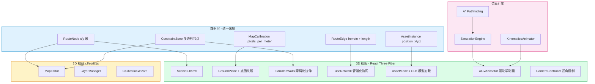
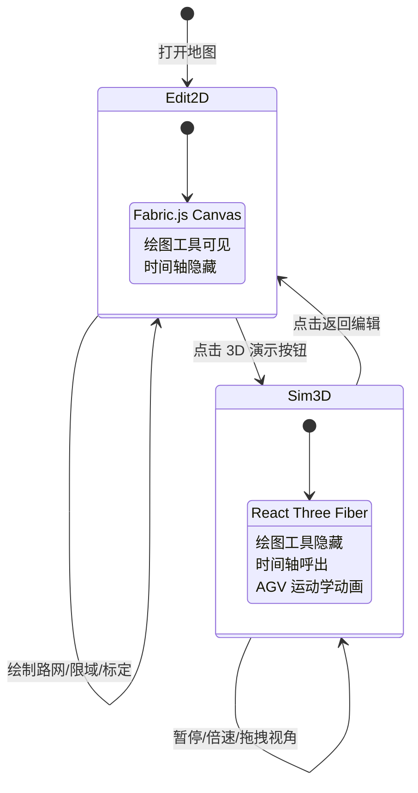
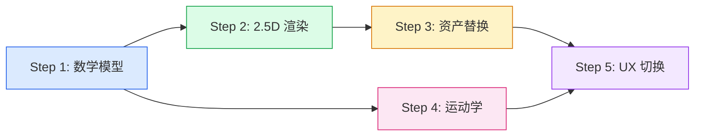

# Phase 5: 2D→3D 升级工作计划

> **目标**: 将 Current 从纯 2D 编辑+仿真工具，升级为 "2D 编辑，3D 瞧" 的双视图工业仿真平台。
> **核心原则**: 数据层不分 2D/3D，3D 只是纯粹的渲染层 (View)。

---

## 现状差距分析

### ✅ 已具备的基础

| 模块 | 现状 | 3D 就绪度 |
|------|------|-----------|
| [`RouteNode`](current-web/lib/types.ts:116) | `{ x, y }` 坐标 | ⚠️ 需确认单位为米 |
| [`ConstraintZone`](current-web/lib/types.ts:149) | `polygon: { points: [number, number][] }` | ✅ 可直接用于 ExtrudeGeometry |
| [`AssetInstance`](current-web/lib/types.ts:69) | `position_x/y/z, rotation, scale` | ✅ 已有 Z 轴和 transform |
| [`PhysicalParams`](current-web/lib/types.ts:49) | `density, friction, mass, bounding_box` | ✅ 物理参数已就绪 |
| [`MapCalibration`](current-web/lib/types.ts:96) | `pixels_per_meter` 比例尺 | ✅ 可用于坐标转换 |
| [`SimulationEngine`](current-web/lib/simulation/engine.ts:119) | `SimPosition { x, y }` + `getAGVPositions()` | ⚠️ 需输出连续插值位置 |
| [`ModelViewer`](current-web/components/viewer-3d/model-viewer.tsx:1) | useGLTF + 自动缩放 | ✅ 可复用为 3D 场景基础 |
| [`A* Pathfinding`](current-web/lib/pathfinding/astar.ts:1) | 完整路网图 + 路径搜索 | ✅ 路径数据可直接映射到 3D |

### ❌ 缺失的关键模块

1. **坐标系统工具** — 缺少 pixel↔meter 双向转换、2D→3D 坐标映射
2. **3D 场景渲染器** — 缺少 React Three Fiber 全场景组件
3. **底图纹理映射** — 缺少将底图铺到 Ground Plane 的能力
4. **障碍物拉伸** — 缺少 2D 多边形→3D ExtrudeGeometry 转换
5. **资产 3D 放置** — 缺少从 AssetInstance 加载 GLB 到场景
6. **路网 3D 渲染** — 缺少 TubeGeometry 管道化路网
7. **运动学动画** — 缺少加速度/减速度/转弯减速的 AGV 动画
8. **视图切换器** — 缺少 2D↔3D 平滑过渡 UX

---

## 架构设计

### 坐标映射规则

```
2D Canvas (像素)  ←→  物理空间 (米)  →  3D Scene (Three.js)
─────────────────────────────────────────────────────
canvas_x (px)     ÷ ppm    →  world_x (m)  →  three_x = world_x
canvas_y (px)     ÷ ppm    →  world_y (m)  →  three_z = world_y  (Y→Z 映射)
                  常量 0   →  height (m)   →  three_y = height    (Y 轴 = 高度)
```

- `ppm` = `pixels_per_meter`（来自 CalibrationWizard 标定结果）
- 2D 的 Y 轴向下 → 3D 的 Z 轴向观察者（右手坐标系）
- 3D 的 Y 轴 = 高度（地面 = 0，墙体向上拉伸）

### 组件架构图



### 双视图切换 UX 流程



---

## 详细实施步骤

### Step 1: 统一底层数学模型

**目标**: 确保所有数据以米为单位存储，建立 pixel↔meter↔3D 坐标转换工具。

**文件变更**:

1. **新建 [`current-web/lib/utils/coordinates.ts`](current-web/lib/utils/coordinates.ts)** — 坐标转换工具
   - `canvasToWorld(canvasX, canvasY, calibration): { x: number, y: number }` — 像素→米
   - `worldToCanvas(worldX, worldY, calibration): { x: number, y: number }` — 米→像素
   - `worldTo3D(worldX, worldY, height?: number): { x: number, y: number, z: number }` — 米→Three.js
   - `threeToWorld(threeX, threeY, threeZ): { x: number, y: number }` — Three.js→米
   - `polygonToShape(points): THREE.Shape` — 2D 多边形→Three.js Shape（用于 ExtrudeGeometry）

2. **修改 [`current-web/lib/simulation/engine.ts`](current-web/lib/simulation/engine.ts)** — 仿真引擎增强
   - `SimPosition` 增加 `heading: number`（朝向角度，弧度）
   - `SimAGV` 增加 `acceleration: number`（加速度 m/s²）
   - 新增 `getAGVStates(): AGVAnimationFrame[]` 方法，输出连续插值位置
   - 新增 `AGVAnimationFrame` 类型：`{ id, x, y, heading, speed, state }`
   - 运动学计算：加速段 `v = v0 + a*t`，匀速段，减速段

3. **修改 [`current-web/app/(dashboard)/simulation/page.tsx`](current-web/app/(dashboard)/simulation/page.tsx)** — Demo 数据米制化
   - DEMO_NODES 坐标改为米（如 `{ id: 'A', x: 0, y: 0 }` → `{ id: 'A', x: 5, y: 5 }`）
   - DEMO_EDGES 长度与实际节点距离一致

### Step 2: 2.5D 场景渲染器

**目标**: 创建 3D 场景基础组件，实现底图纹理铺地 + 障碍物一键拉伸。

**文件变更**:

4. **新建 [`current-web/components/scene-3d/scene-viewer.tsx`](current-web/components/scene-3d/scene-viewer.tsx)** — 3D 场景主入口
   - React Three Fiber Canvas
   - 环境光 + 方向光 + 阴影
   - OrbitControls（限制：最小高度 1m，最大距离 200m）
   - GizmoHelper 坐标轴
   - Stats 性能监控（开发模式）

5. **新建 [`current-web/components/scene-3d/ground-plane.tsx`](current-web/components/scene-3d/ground-plane.tsx)** — 地面 + 底图纹理
   - `THREE.PlaneGeometry` 作为地面网格（Grid Helper）
   - 底图作为 `MeshStandardMaterial` 的 `map` 纹理
   - 根据 `MapCalibration.pixels_per_meter` 计算地面尺寸
   - 旋转 -90° 绕 X 轴（让平面水平）

6. **新建 [`current-web/components/scene-3d/extruded-walls.tsx`](current-web/components/scene-3d/extruded-walls.tsx)** — 障碍物拉伸
   - 读取 `ConstraintZone[]`（zone_type = 'obstacle' | 'keep_out'）
   - 每个多边形 → `THREE.Shape` → `ExtrudeGeometry`
   - 默认拉伸高度 3m（可配置）
   - 材质：半透明红色 `MeshStandardMaterial`（opacity 0.6）
   - 可选：墙体顶部边缘发光效果

7. **新建 [`current-web/components/scene-3d/tube-network.tsx`](current-web/components/scene-3d/tube-network.tsx)** — 管道化路网
   - 读取 `RouteEdge[]` + `RouteNode[]`
   - 每条边 → `THREE.LineCurve3` → `TubeGeometry`
   - 管道半径 0.05m，半透明蓝色
   - 互斥区段用黄色/橙色标识
   - 路面标线效果（可选）

### Step 3: 3D 资产替换

**目标**: 从 2D 占位方块升级为真实 3D GLB 模型，支持从资产库拖拽放置。

**文件变更**:

8. **新建 [`current-web/components/scene-3d/asset-models.tsx`](current-web/components/scene-3d/asset-models.tsx)** — 3D 资产渲染
   - 读取 `AssetInstance[]`（含 `asset_id`, `position_x/y/z`, `rotation`, `scale`）
   - 根据 `asset_id` 查询 `Asset.model_url`
   - 使用 `useGLTF` 加载 GLB 模型
   - 放置到 `worldTo3D(position_x, position_y, position_z)` 坐标
   - 应用 `rotation`（绕 Y 轴旋转）和 `scale`
   - 自动计算包围盒对齐地面

9. **新建 [`current-web/components/scene-3d/agv-animator.tsx`](current-web/components/scene-3d/agv-animator.tsx)** — AGV 运动学动画
   - 读取 `SimulationEngine.getAGVStates()` 的帧数据
   - 每个 AGV 加载对应类型的 GLB 模型（或默认占位方块）
   - 使用 `useFrame` 钩子实现逐帧动画
   - 运动学插值：
     - 直线段：匀速/加速/减速（`v = v0 + a * dt`）
     - 转弯处：根据曲率自动减速（`v_turn = v_max * factor`）
     - 到站停靠：减速→停止→等待→加速离开
   - AGV 朝向平滑过渡（`Quaternion.slerp`）

10. **修改 [`current-web/app/(dashboard)/map/page.tsx`](current-web/app/(dashboard)/map/page.tsx)** — 资产拖拽放置
    - 右侧属性面板增加 "资产库" 快捷选择
    - 从资产库选择模型后，在 2D Canvas 上点击放置
    - 放置后创建 `AssetInstance` 记录
    - 2D Canvas 上显示资产轮廓矩形（逻辑体）

### Step 4: 路网 3D 渲染 + 运动学动画

**目标**: AGV 动画从简单线条移动升级为带物理运动学的真实演示。

**文件变更**:

11. **新建 [`current-web/lib/simulation/kinematics.ts`](current-web/lib/simulation/kinematics.ts)** — 运动学计算器
    - `KinematicsConfig`: `{ maxSpeed, acceleration, deceleration, turnSpeedFactor }`
    - `computeSpeedProfile(path, edges, kinematics): SpeedProfile[]`
    - `SpeedProfile`: `{ edgeId, startSpeed, endSpeed, distance, time }`
    - `interpolatePosition(profile, time): { x, y, heading, speed }`
    - 预计算每段路径的速度曲线

12. **修改 [`current-web/lib/simulation/engine.ts`](current-web/lib/simulation/engine.ts)** — 集成运动学
    - `SimAGVConfig` 增加 `acceleration: number` 和 `deceleration: number`
    - `moveAGV()` 方法改用运动学计算替代匀速移动
    - 新增 `getAnimationFrame(): SimulationFrame` 方法
    - `SimulationFrame`: `{ time, agvs: AGVFrame[], events: SimEvent[] }`

13. **新建 [`current-web/components/scene-3d/camera-controller.tsx`](current-web/components/scene-3d/camera-controller.tsx)** — 智能相机
    - 编辑模式：正交顶视图（OrthographicCamera）
    - 演示模式：透视跟随视角（PerspectiveCamera）
    - 平滑过渡动画（lerp position + slerp rotation）
    - "跟随 AGV" 模式：相机自动跟踪选中 AGV
    - "自由飞行" 模式：WASD + 鼠标控制

### Step 5: 双视图切换 UX

**目标**: 实现 "2D 编辑，3D 瞧" 的无缝切换体验。

**文件变更**:

14. **新建 [`current-web/components/shared/view-mode-switcher.tsx`](current-web/components/shared/view-mode-switcher.tsx)** — 视图切换器
    - 切换按钮：`2D 编辑` ↔ `3D 演示`
    - 切换动画：fade + scale 过渡
    - 状态管理：Zustand store 或 Context

15. **修改 [`current-web/app/(dashboard)/map/page.tsx`](current-web/app/(dashboard)/map/page.tsx)** — 集成双视图
    - 顶部增加 ViewModeSwitcher
    - 2D 模式：显示 MapEditor + LayerManager + 工具栏
    - 3D 模式：显示 Scene3DView + 时间轴 + 播放控制
    - 切换时保持数据同步

16. **修改 [`current-web/app/(dashboard)/simulation/page.tsx`](current-web/app/(dashboard)/simulation/page.tsx)** — 3D 仿真视图
    - 将 SVG 路网替换为 Scene3DView
    - 集成 AGVAnimator 到 3D 场景
    - 保留右侧数据看板
    - 底部时间轴联动 3D 动画

17. **新建 [`current-web/lib/stores/view-store.ts`](current-web/lib/stores/view-store.ts)** — 视图状态管理
    - Zustand store
    - `viewMode: '2d' | '3d'`
    - `cameraPreset: 'top' | 'perspective' | 'follow'`
    - `selectedAGVId: string | null`
    - `isPlaying: boolean`
    - `playbackSpeed: number`

---

## 依赖关系



## 技术选型

| 需求 | 方案 | 备注 |
|------|------|------|
| 3D 渲染 | React Three Fiber + @react-three/drei | 已安装 |
| 状态管理 | Zustand | 已安装 |
| 物理引擎 | 暂不引入 | Phase 6 考虑 PhysX.js/Ammo.js |
| 模型格式 | GLB/GLTF | 已有 useGLTF 加载器 |
| 动画 | useFrame + lerp/slerp | 纯前端插值 |
| 坐标转换 | 自建工具函数 | pixel↔meter↔three.js |

## 风险与注意事项

1. **性能**: 大量 GLB 模型同时加载可能导致内存问题 → 使用 InstancedMesh + LOD
2. **Z 轴漂移**: 3D 模式下拖拽容易发生高度偏移 → 限制 Y 轴移动，使用 Raycaster 投射到地面
3. **Fabric.js 与 R3F 共存**: 两个 Canvas 同时存在时性能 → 切换时卸载非活跃视图
4. **底图纹理**: 大尺寸 DXF/PDF 转纹理可能超 WebGL 限制 → 预缩放到 4096×4096
5. **运动学精度**: 帧率波动影响动画平滑度 → 使用固定时间步长 (fixed timestep)
