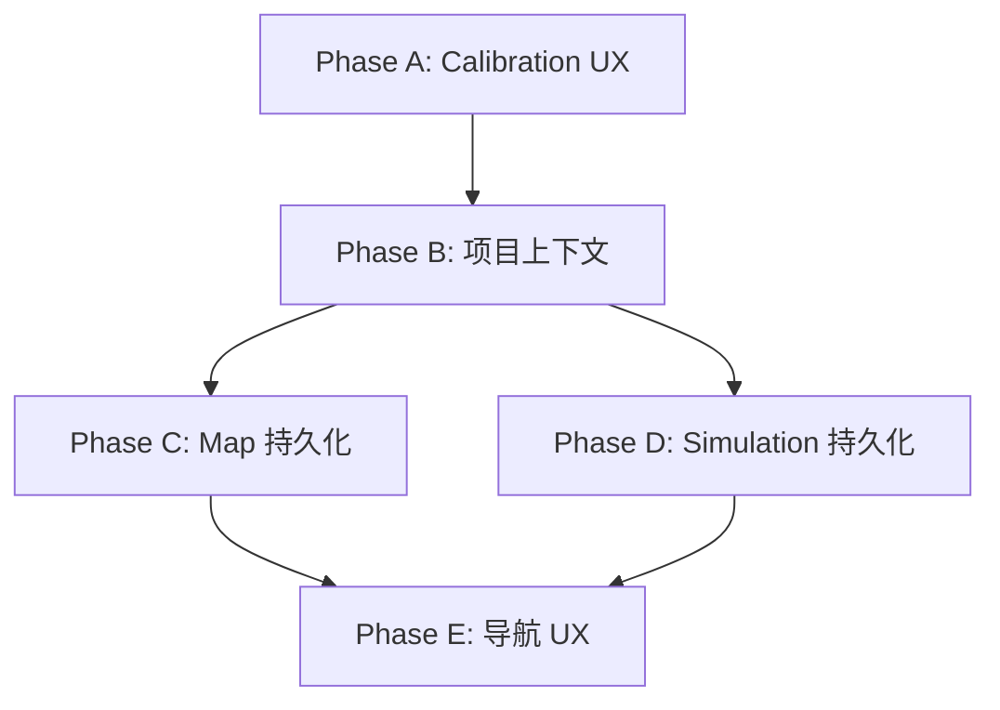

# Phase 7: 数据持久化 + Calibration UX 增强

## 问题概述

当前所有页面数据都在 React 本地 state 中，刷新即丢失：
- Map Editor：底图、标定、图层、节点、路段、资产放置全部不保存
- Simulation：配置和结果不保存
- 没有项目上下文传递，页面间无关联

数据库 Schema 已设计好（`maps`, `map_layers`, `route_nodes`, `route_edges`, `constraint_zones`, `simulations`），但前端未对接。

---

## Phase A: Calibration UX 增强

### 当前问题
- 进入标定模式后没有视觉反馈（无十字光标、无精度圆）
- 点击第一个点后没有跟随鼠标的预览线
- 距离输入只显示 "meters"，不允许切换单位

### 修复计划

#### A1. 十字光标 + 精度圆
- `map-editor.tsx` 中 `calibrate` 工具激活时设置 `canvas.defaultCursor = 'crosshair'`
- 添加 `mouse:move` 事件：在标定模式下显示一个跟随鼠标的半透明圆圈（精度指示器，半径 10px）
- 使用 Fabric.js 的临时对象（不加入 canvas objects 数组，每帧重绘）

#### A2. 实时预览线
- 标定第一个点标记后，`mouse:move` 事件中绘制从第一个点到当前鼠标位置的虚线
- 使用 canvas overlay 或临时 Line 对象实现
- 点击第二个点后预览线消失，自动进入距离输入步骤

#### A3. 单位选择
- `calibration-wizard.tsx` 的距离输入区域添加单位下拉框
- 选项：m / cm / ft / in（基于用户选择的单位系统提供默认值，但允许手动切换）
- 内部始终存储为米，输入时根据选择的单位转换

### 涉及文件
- `components/editor-2d/map-editor.tsx` — 十字光标、预览线、精度圆
- `components/editor-2d/calibration-wizard.tsx` — 单位选择下拉框
- `lib/i18n/translations.ts` — 新增单位相关翻译键

---

## Phase B: 项目上下文基础设施

### B1. Project Store（Zustand）
- 新建 `lib/project-store.ts`
- 存储：`currentProjectId`, `currentProjectName`, `setCurrentProject()`
- persist 到 localStorage

### B2. URL Params 传递
- Map 页面：`/map?project={id}`
- Simulation 页面：`/simulation?project={id}`
- 首页项目列表点击 → 跳转带 project 参数

### B3. Maps API Routes
- `app/api/maps/route.ts` — GET list, POST create
- `app/api/maps/[id]/route.ts` — GET, PATCH, DELETE
- Maps 关联 project_id

### 涉及文件
- `lib/project-store.ts` — 新建
- `app/api/maps/route.ts` — 新建
- `app/api/maps/[id]/route.ts` — 新建
- `app/(dashboard)/map/page.tsx` — 读取 project param
- `app/(dashboard)/simulation/page.tsx` — 读取 project param

---

## Phase C: Map Editor 持久化

### C1. Base Map 保存
- 导入底图时上传到 Supabase Storage `maps/base-images/`
- 保存 `base_image_url` 到 `maps` 表
- 页面加载时从 `maps` 表读取 `base_image_url` 并加载

### C2. Calibration 保存
- 标定完成后保存到 `maps.calibration` JSONB 字段
- 页面加载时恢复标定数据

### C3. Layers 保存
- 图层变更时（增删改）同步到 `map_layers` 表
- 页面加载时从 `map_layers` 表恢复

### C4. Route Network 保存
- 节点添加/删除 → `route_nodes` 表
- 路段添加/删除 → `route_edges` 表
- 页面加载时恢复路网

### C5. Placed Assets 保存
- 资产放置 → `asset_instances` 表
- 页面加载时恢复已放置资产

### C6. Auto-save
- 使用 debounce（1秒）自动保存 canvas 变更
- `canvas.on('object:added')` / `canvas.on('object:modified')` / `canvas.on('object:removed')` 触发保存

### 涉及文件
- `app/api/maps/route.ts` — base_image_url 保存
- `components/editor-2d/map-editor.tsx` — 加载/保存逻辑
- `app/(dashboard)/map/page.tsx` — 初始化加载
- 新建 API routes: `app/api/map-layers/`, `app/api/route-nodes/`, `app/api/route-edges/`, `app/api/asset-instances/`（部分已有）

---

## Phase D: Simulation 持久化

### D1. Config 保存
- 仿真配置变更时保存到 `simulations.config` JSONB
- 页面加载时恢复配置

### D2. Results 保存
- 仿真完成后保存结果到 `simulations.results` JSONB
- 保存状态、时间戳

### D3. 历史记录
- 侧边栏显示历史仿真记录列表
- 点击可查看历史结果

### 涉及文件
- `app/api/simulations/route.ts` — 新建
- `app/api/simulations/[id]/route.ts` — 新建
- `app/(dashboard)/simulation/page.tsx` — 加载/保存逻辑

---

## Phase E: 导航 UX

### E1. Sidebar 项目显示
- Sidebar 顶部显示当前项目名称
- 点击可切换项目

### E2. 页面间导航
- 首页项目列表 → Map Editor（带 project_id）
- Map Editor → Simulation（带 project_id）
- 所有页面共享 project context

### 涉及文件
- `components/sidebar.tsx` — 项目显示
- `app/(dashboard)/home-content.tsx` — 项目跳转链接
- `app/(dashboard)/layout.tsx` — 项目 context provider

---

## 执行顺序

Phase A 可独立执行（纯前端 UX 改进）。
Phase B 是 Phase C/D 的前置依赖。
Phase C/D 可并行。
Phase E 最后收尾。

---

## 技术约束

- 所有 API routes 使用 `createClient()` from `@/lib/supabase/server` 
- RLS 策略确保用户只能访问自己的项目数据
- Base map 图片上传到 Supabase Storage
- 内部存储始终使用米制，显示时根据用户单位偏好转换
- Auto-save 使用 debounce 避免频繁写入
