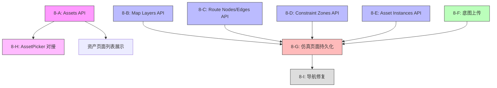

# Phase 8: 后端 Schema ↔ 前端实现 对应检查与修复计划

## 审计结果总览

### 数据库表（10 张）vs API 路由 vs 前端对接状态

| # | 数据库表 | API 路由 | 前端对接 | 状态 |
|---|---------|---------|---------|------|
| 1 | `projects` | ✅ `/api/projects` + `/api/projects/[id]` CRUD | ✅ 首页列表+创建+跳转 | **完成** |
| 2 | `assets` | ⚠️ 仅通过 inference pipeline 创建 | ❌ 资产页面不读取数据库 | **缺失** |
| 3 | `asset_instances` | ❌ Placeholder（假数据） | ❌ 放置资产不持久化 | **缺失** |
| 4 | `maps` | ✅ `/api/maps` + `/api/maps/[id]` CRUD | ✅ 地图页面加载/创建/保存标定 | **部分完成** |
| 5 | `map_layers` | ❌ 无 API 路由 | ❌ 图层仅本地 state | **缺失** |
| 6 | `route_nodes` | ❌ 无 API 路由 | ❌ 节点仅本地 state | **缺失** |
| 7 | `route_edges` | ❌ 无 API 路由 | ❌ 边仅本地 state | **缺失** |
| 8 | `constraint_zones` | ❌ 无 API 路由 | ❌ 约束区域仅本地 state | **缺失** |
| 9 | `simulations` | ✅ `/api/simulations` + `/api/simulations/[id]` CRUD | ❌ 仿真页面未使用 | **缺失** |
| 10 | `inference_jobs` | ✅ 创建+读取+更新 | ⚠️ 上传触发但无进度追踪 UI | **部分完成** |

---

## 详细差距分析

### Gap 1: Assets — 资产库页面完全未对接数据库

**现状**：
- [`assets/page.tsx`](current-web/app/(dashboard)/assets/page.tsx) 可以上传图片触发推理
- 但**不读取** `assets` 表，永远显示空列表
- 属性面板全是静态 `<input>`，不绑定任何数据
- 分类筛选按钮无 `onClick` 处理
- 导出按钮（GLB/URDF/MJCF）无功能
- 推理上传后只显示成功消息，不追踪推理进度

**缺失 API**：
- `GET /api/assets` — 列出所有资产
- `GET /api/assets/[id]` — 获取单个资产详情
- `PATCH /api/assets/[id]` — 更新资产属性
- `DELETE /api/assets/[id]` — 删除资产

**需修改文件**：
- 新建 `current-web/app/api/assets/route.ts`
- 新建 `current-web/app/api/assets/[id]/route.ts`
- 重写 `current-web/app/(dashboard)/assets/page.tsx`

---

### Gap 2: Asset Instances — 放置资产不持久化

**现状**：
- [`asset-instances/route.ts`](current-web/app/api/asset-instances/route.ts) 是 **placeholder**，返回假数据
- 地图页面 `placedAssets` 是 `useState`，刷新即丢失
- 放置资产时不调用 API

**需修改文件**：
- 重写 `current-web/app/api/asset-instances/route.ts`（用 Supabase）
- 新建 `current-web/app/api/asset-instances/[id]/route.ts`（PATCH/DELETE）
- 修改 `current-web/app/(dashboard)/map/page.tsx`：放置/移动/删除资产时调 API

---

### Gap 3: Map Layers — 图层不持久化

**现状**：
- [`layer-manager.tsx`](current-web/components/editor-2d/layer-manager.tsx) 管理本地 `LayerItem[]` state
- 地图页面初始化 3 个默认图层（base_map / constraint_zone / routing）
- 增删改图层只更新本地 state，不调 API
- 数据库 `map_layers` 表有完整的 `name, type, z_index, visible, locked, opacity, data` 字段

**缺失 API**：
- `GET /api/map-layers?map_id=xxx` — 列出图层
- `POST /api/map-layers` — 创建图层
- `PATCH /api/map-layers/[id]` — 更新图层
- `DELETE /api/map-layers/[id]` — 删除图层

**需修改文件**：
- 新建 `current-web/app/api/map-layers/route.ts`
- 新建 `current-web/app/api/map-layers/[id]/route.ts`
- 修改 `current-web/components/editor-2d/layer-manager.tsx`：增删改时回调 API
- 修改 `current-web/app/(dashboard)/map/page.tsx`：初始化时加载图层

---

### Gap 4: Route Nodes — 路网节点不持久化

**现状**：
- [`map-editor.tsx`](current-web/components/editor-2d/map-editor.tsx) 的 `addNode()` 只在 canvas 上画圆
- 通过 `onToolAction('node_added', ...)` 通知父组件
- 但地图页面 `handleToolAction` 只处理 `calibration_points` 和 `select_element`
- **节点数据完全不持久化**

**缺失 API**：
- `GET /api/route-nodes?map_id=xxx`
- `POST /api/route-nodes`
- `PATCH /api/route-nodes/[id]`
- `DELETE /api/route-nodes/[id]`

**需修改文件**：
- 新建 `current-web/app/api/route-nodes/route.ts`
- 新建 `current-web/app/api/route-nodes/[id]/route.ts`
- 修改 `current-web/app/(dashboard)/map/page.tsx`：处理 `node_added` 事件
- 修改 `current-web/components/editor-2d/map-editor.tsx`：节点 ID 使用 UUID

---

### Gap 5: Route Edges — 路网边不持久化

**现状**：
- `addRouteLine()` 只在 canvas 上画线
- 同上，`handleToolAction` 不处理 `edge_added`
- `route_edges` 表有 `from_node_id, to_node_id, length, speed_limit, direction, constraints` 等字段

**缺失 API**：
- `GET /api/route-edges?map_id=xxx`
- `POST /api/route-edges`
- `PATCH /api/route-edges/[id]`
- `DELETE /api/route-edges/[id]`

**需修改文件**：
- 新建 `current-web/app/api/route-edges/route.ts`
- 新建 `current-web/app/api/route-edges/[id]/route.ts`
- 修改 `current-web/app/(dashboard)/map/page.tsx`：处理 `edge_added` 事件

---

### Gap 6: Constraint Zones — 约束区域不持久化

**现状**：
- `addObstacleZone()` 只在 canvas 上画多边形
- `constraint_zones` 表有 `name, zone_type, polygon, rules` 字段

**缺失 API**：
- `GET /api/constraint-zones?map_id=xxx`
- `POST /api/constraint-zones`
- `PATCH /api/constraint-zones/[id]`
- `DELETE /api/constraint-zones/[id]`

**需修改文件**：
- 新建 `current-web/app/api/constraint-zones/route.ts`
- 新建 `current-web/app/api/constraint-zones/[id]/route.ts`
- 修改 `current-web/app/(dashboard)/map/page.tsx`：处理 `zone_added` 事件

---

### Gap 7: 底图不持久化到 Storage

**现状**：
- `importBaseImage()` 将图片渲染到 canvas，仅存在于内存
- 刷新页面后底图消失
- `maps` 表有 `base_image_url, base_image_width, base_image_height` 字段
- Schema 定义了 `maps-base-images` Storage bucket

**需修改**：
- 新建 `current-web/app/api/maps/[id]/upload-image/route.ts` — 上传底图到 Storage
- 修改 `current-web/app/(dashboard)/map/page.tsx`：导入底图后上传到 Storage 并保存 URL
- 修改 `current-web/components/editor-2d/map-editor.tsx`：初始化时恢复底图

---

### Gap 8: 仿真页面未对接数据库

**现状**：
- [`simulation/page.tsx`](current-web/app/(dashboard)/simulation/page.tsx) 使用硬编码 `DEMO_NODES` / `DEMO_EDGES`
- 不读取 `project_id` URL 参数
- 不创建/加载 simulation 记录
- 不保存 config 和 results
- 所有状态都是 `useState`，刷新即丢失

**需修改文件**：
- 修改 `current-web/app/(dashboard)/simulation/page.tsx`：
  - 读取 `?project=` URL 参数
  - 初始化时加载/创建 simulation 记录
  - 从 `route_nodes`/`route_edges` 读取路网数据（替代 DEMO 数据）
  - 仿真完成后保存 results
  - 保存 config 变更

---

### Gap 9: AssetPicker 使用硬编码 Demo 数据

**现状**：
- [`asset-picker.tsx`](current-web/components/editor-2d/asset-picker.tsx) 使用 `DEMO_ASSET_KEYS` 硬编码列表
- 不从 `assets` 表读取

**需修改**：
- 修改 `asset-picker.tsx`：`useEffect` 从 `/api/assets` 获取真实资产列表
- 保留 demo 数据作为 fallback（无资产时）

---

### Gap 10: 导航链接缺少 project 参数

**现状**：
- 首页仿真链接指向 `/simulation`（无 `?project=` 参数）
- 地图页面直接访问 URL 时不调用 `setCurrentProject`

**需修改**：
- 修改 `current-web/app/(dashboard)/home-content.tsx`：仿真链接加 `?project={id}`
- 修改 `current-web/app/(dashboard)/map/page.tsx`：初始化时调用 `setCurrentProject`

---

## 执行计划（按优先级排序）

### Phase 8-A: Assets API + 资产页面对接
1. 新建 `GET /api/assets` — 列出所有资产（支持 category 筛选）
2. 新建 `GET/PATCH/DELETE /api/assets/[id]` — 单资产操作
3. 重写资产页面：加载资产列表、选中查看详情、属性编辑保存
4. 添加推理进度轮询（上传后定期查询 job status）

### Phase 8-B: Map Layers API + 图层持久化
1. 新建 `GET/POST /api/map-layers`
2. 新建 `GET/PATCH/DELETE /api/map-layers/[id]`
3. 地图页面初始化时加载图层
4. 图层增删改时调 API

### Phase 8-C: Route Nodes/Edges API + 路网持久化
1. 新建 `GET/POST /api/route-nodes` + `GET/PATCH/DELETE /api/route-nodes/[id]`
2. 新建 `GET/POST /api/route-edges` + `GET/PATCH/DELETE /api/route-edges/[id]`
3. 地图页面处理 `node_added` / `edge_added` 事件
4. 初始化时恢复已保存的节点和边

### Phase 8-D: Constraint Zones API + 约束区域持久化
1. 新建 `GET/POST /api/constraint-zones` + `GET/PATCH/DELETE /api/constraint-zones/[id]`
2. 地图页面处理 `zone_added` 事件
3. 初始化时恢复已保存的约束区域

### Phase 8-E: Asset Instances API + 放置资产持久化
1. 重写 `asset-instances/route.ts`（用 Supabase 替代 placeholder）
2. 新建 `PATCH/DELETE /api/asset-instances/[id]`
3. 地图页面放置/移动/删除资产时调 API
4. 初始化时恢复已放置的资产

### Phase 8-F: 底图上传到 Storage
1. 新建 `POST /api/maps/[id]/upload-image` — 上传到 `maps-base-images` bucket
2. 导入底图后自动上传并保存 URL
3. 初始化时从 URL 恢复底图

### Phase 8-G: 仿真页面持久化
1. 仿真页面读取 `?project=` 参数
2. 初始化时加载/创建 simulation 记录
3. 从 `route_nodes`/`route_edges` 读取路网数据
4. 保存 config 变更和 results

### Phase 8-H: AssetPicker 对接 + 资产页面完善
1. AssetPicker 从 `/api/assets` 获取真实资产
2. 保留 demo fallback
3. 资产页面展示推理进度

### Phase 8-I: 导航修复
1. 首页仿真链接加 `?project={id}`
2. 地图页面初始化时 `setCurrentProject`

---

## 依赖关系图

## 预计新建文件清单

| 文件路径 | 用途 |
|---------|------|
| `app/api/assets/route.ts` | 资产列表 GET |
| `app/api/assets/[id]/route.ts` | 资产详情/更新/删除 |
| `app/api/map-layers/route.ts` | 图层列表/创建 |
| `app/api/map-layers/[id]/route.ts` | 图层更新/删除 |
| `app/api/route-nodes/route.ts` | 节点列表/创建 |
| `app/api/route-nodes/[id]/route.ts` | 节点更新/删除 |
| `app/api/route-edges/route.ts` | 边列表/创建 |
| `app/api/route-edges/[id]/route.ts` | 边更新/删除 |
| `app/api/constraint-zones/route.ts` | 约束区域列表/创建 |
| `app/api/constraint-zones/[id]/route.ts` | 约束区域更新/删除 |
| `app/api/asset-instances/[id]/route.ts` | 放置资产更新/删除 |
| `app/api/maps/[id]/upload-image/route.ts` | 底图上传 |

## 预计修改文件清单

| 文件路径 | 修改内容 |
|---------|---------|
| `app/api/asset-instances/route.ts` | 替换 placeholder 为 Supabase |
| `app/(dashboard)/assets/page.tsx` | 资产列表+详情+编辑 |
| `app/(dashboard)/map/page.tsx` | 所有持久化逻辑 |
| `app/(dashboard)/simulation/page.tsx` | 项目上下文+持久化 |
| `app/(dashboard)/home-content.tsx` | 仿真链接加 project 参数 |
| `components/editor-2d/asset-picker.tsx` | 从数据库读取 |
| `components/editor-2d/layer-manager.tsx` | API 回调 |
| `components/editor-2d/map-editor.tsx` | 恢复底图+节点/边 UUID |
