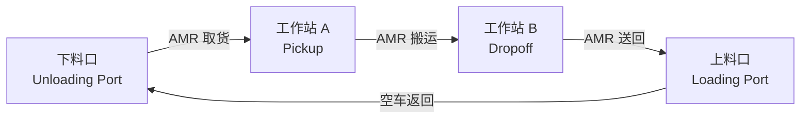

# Phase 9: 3D 资产检视增强 + 物流吞吐量仿真

## 概述

两个核心功能：
1. **3D 资产检视** — 上传生成的 3D 模型可在系统内旋转/检视，显示物理尺寸，在地图和仿真阶段按正确比例显示
2. **物流吞吐量仿真** — 在地图编辑器中定义上料口/下料口/工作站，配置吞吐量参数，基于 AMR 数量和速度预估整体吞吐量

---

## 9-A: 3D 资产检视增强

### 现有基础
- `ModelViewer` 组件已有 GLB 加载 + OrbitControls + Grid + GizmoHelper
- Assets 页面已有 3D 预览（有 model_url 时显示 3D，否则显示源图片）
- Asset 类型已有 `dimension_length/width/height` 字段

### 需要改动

#### 9-A1: Assets 页面尺寸标注面板
- 在右侧属性面板中，3D 模型下方显示物理尺寸（L × W × H）+ 单位
- 显示质量、材料等 physical_params 信息
- 添加"在地图中使用"按钮（跳转到地图页面并选中该资产）

#### 9-A2: ModelViewer 增强显示
- 添加尺寸标注线（Bounding Box 边缘标注 L/W/H）
- 显示坐标轴标签
- 显示网格单位（米/厘米）

#### 9-A3: 地图编辑器中资产按比例缩放
- 放置资产时，根据 `dimension_length` × `pixels_per_meter` 计算画布上的实际像素尺寸
- 3D 场景中同样按物理尺寸渲染（`AssetModels` 组件中使用 `dimension_length` 替代固定缩放）

### 涉及文件
- `components/viewer-3d/model-viewer.tsx` — 添加尺寸标注
- `app/(dashboard)/assets/page.tsx` — 增强属性面板
- `components/editor-2d/map-editor.tsx` — 放置时按比例缩放
- `components/scene-3d/asset-models.tsx` — 3D 场景按比例渲染

---

## 9-B: 物流节点类型

### 概念模型

```
┌──────────┐     ┌──────────────┐     ┌──────────────┐     ┌──────────┐
│  下料口   │ ──► │  工作站 A     │ ──► │  工作站 B     │ ──► │  上料口   │
│ Unloading │     │  Pickup      │     │  Dropoff     │     │ Loading  │
│  Port     │     │  Station     │     │  Station     │     │  Port    │
└──────────┘     └──────────────┘     └──────────────┘     └──────────┘
   Source            Processing          Processing           Sink
 throughput:        pickup_time:        dropoff_time:       throughput:
  60 items/hr        30s/item            20s/item            60 items/hr
```

### 数据模型扩展

#### route_nodes 表扩展
在现有 `route_nodes` 表的 `node_type` 字段中添加新类型：
- `waypoint` — 普通路径点（现有）
- `loading_port` — 上料口（货物回收点）
- `unloading_port` — 下料口（货物发放点）
- `workstation` — 工作站（pickup/dropoff 点）

新增字段（通过 ALTER TABLE 或 JSON metadata）：
```sql
ALTER TABLE route_nodes ADD COLUMN IF NOT EXISTS
  logistics_config JSONB DEFAULT '{}';
-- logistics_config: {
--   "throughput_items_per_hour": 60,
--   "processing_time_seconds": 30,
--   "buffer_capacity": 10,
--   "operation_type": "pickup" | "dropoff" | "both"
-- }
```

### 需要改动

#### 9-B1: 地图编辑器新增物流节点工具
- 工具栏添加 3 个新工具按钮：上料口、下料口、工作站
- 每种类型在画布上用不同颜色/图标显示：
  - 上料口：绿色圆形 + 向上箭头
  - 下料口：红色圆形 + 向下箭头
  - 工作站：蓝色方形 + W 标记
- 点击画布放置，自动创建对应类型的 route_node

#### 9-B2: 物流节点属性面板
- 选中物流节点时，右侧属性面板显示：
  - 节点类型（只读）
  - 吞吐量（items/hour）滑块
  - 处理时间（秒/件）输入
  - 缓冲区容量
  - 操作类型（pickup/dropoff/both）

#### 9-B3: 数据库 Schema 更新
- 添加 `logistics_config` 列到 `route_nodes` 表
- 更新 API 路由支持新字段
- 更新 TypeScript 类型定义

### 涉及文件
- `lib/types.ts` — 扩展 RouteNode 类型
- `components/editor-2d/map-editor.tsx` — 新增物流节点工具
- `app/(dashboard)/map/page.tsx` — 物流节点属性面板 + 持久化
- `app/api/route-nodes/route.ts` — 支持 logistics_config
- SQL migration: `route_nodes` 添加 `logistics_config` 列

---

## 9-C: 吞吐量仿真引擎

### 任务链模型



### 核心算法

**吞吐量预估公式：**
```
系统吞吐量 = min(
  各站点吞吐量,
  AMR 运力 = AMR数量 × 平均速度 / 平均任务距离 × 3600 / 任务周期时间
)

任务周期时间 = 取货时间 + 运输时间1 + 放货时间 + 运输时间2 + 空跑时间
```

### 需要改动

#### 9-C1: 物流任务链配置 UI
- 在仿真页面添加"任务链配置"面板
- 可视化拖拽定义任务流：下料口 → 工作站 → 工作站 → 上料口
- 每个环节可配置处理时间
- 自动计算预期吞吐量

#### 9-C2: 扩展仿真引擎
- `TaskChain` 类型：定义有序的节点序列和每个节点的处理时间
- `LogisticsSimEngine` 扩展 `SimulationEngine`：
  - 从物流节点自动生成任务链
  - 每个任务包含完整的 pickup → transport → dropoff → return 流程
  - 站点排队模型（FIFO + buffer capacity）
  - 吞吐量统计（per-station + system-wide）

#### 9-C3: 吞吐量预估计算器
- 独立的吞吐量计算模块（不需要运行完整仿真）
- 输入：站点配置 + AMR 配置 + 路网距离
- 输出：理论最大吞吐量 + 瓶颈站点 + 建议优化

### 涉及文件
- `lib/simulation/logistics-engine.ts` — 新建物流仿真引擎
- `lib/simulation/throughput-calculator.ts` — 新建吞吐量计算器
- `components/simulation/task-chain-panel.tsx` — 新建任务链配置面板
- `app/(dashboard)/simulation/page.tsx` — 集成物流仿真

---

## 9-D: 结果可视化

### 需要改动

#### 9-D1: 吞吐量仪表板
- 系统总吞吐量（items/hour）大数字卡片
- 各站点吞吐量柱状图
- AMR 利用率饼图
- 任务完成时间分布直方图

#### 9-D2: 瓶颈分析
- 自动识别瓶颈站点（吞吐量最低的站点）
- 瓶颈站点高亮显示在地图上
- 优化建议（增加 AMR / 提高站点速度 / 增加缓冲区）

#### 9-D3: 吞吐量报表
- 导出仿真结果（CSV/JSON）
- 参数敏感性分析（改变 AMR 数量对吞吐量的影响曲线）

### 涉及文件
- `components/simulation/throughput-dashboard.tsx` — 新建吞吐量仪表板
- `components/simulation/bottleneck-analysis.tsx` — 新建瓶颈分析组件
- `app/(dashboard)/simulation/page.tsx` — 集成结果可视化

---

## 实施顺序

```
9-A1 → 9-A2 → 9-A3 → 9-B1 → 9-B2 → 9-B3 → 9-C1 → 9-C2 → 9-C3 → 9-D1 → 9-D2 → 9-D3
 │        │       │       │       │       │       │        │       │       │       │       │
 │        │       │       └───────┴───────┘       │        │       │       │       │       │
 │        │       │          9-B: 物流节点         │        │       │       │       │       │
 │        │       │                               │        │       │       │       │       │
 └────────┴───────┘                               └────────┴───────┘       └───────┴───────┘
    9-A: 3D 资产                                       9-C: 仿真引擎           9-D: 可视化
```

## 技术约束

- 所有物流节点存储在现有 `route_nodes` 表中（通过 `node_type` 区分）
- `logistics_config` 使用 JSONB 字段，避免频繁 Schema 变更
- 仿真引擎扩展不破坏现有的 `SimulationEngine` API
- 前端组件复用现有的设计令牌和 UI 组件
